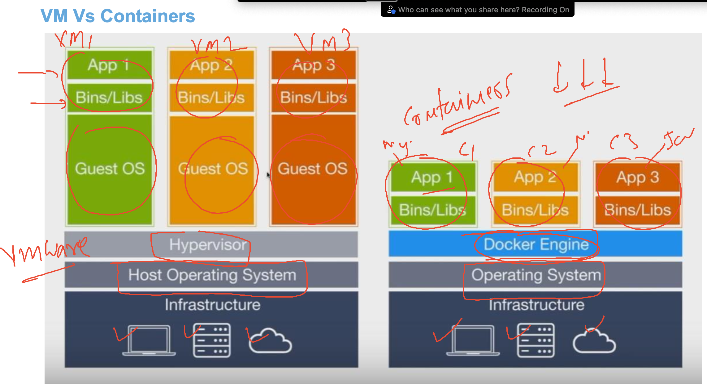

# k8s-cloud4c-b4

## plan


### problem in our past experience


### bare-metal solution using hypervisor with virtualization 


## introduce containers



### introduction container engines 


## Installation 


### docker desktop


### login to remote linux machine from windows powershell using ssh

```

PS C:\Users\humanfirmware> ssh  ashu@43.205.221.152
The authenticity of host '43.205.221.152 (43.205.221.152)' can't be established.
ED25519 key fingerprint is SHA256:3L/XWgBb2uRFS7dX2R8hCmhGnAwuLiG9UY3W1IBqLzU.
This key is not known by any other names
Are you sure you want to continue connecting (yes/no/[fingerprint])? yes
Warning: Permanently added '43.205.221.152' (ED25519) to the list of known hosts.
ashu@43.205.221.152's password:

       __|  __|_  )
       _|  (     /   Amazon Linux 2 AMI
      ___|\___|___|

https://aws.amazon.com/amazon-linux-2/
[ashu@ip-172-31-9-111 ~]$ whoami
ashu
[ashu@ip-172-31-9-111 ~]$


```

### verify docker connection 

```
[ashu@ip-172-31-9-111 ~]$ docker version
Client:
 Version:           20.10.23
 API version:       1.41
 Go version:        go1.18.9
 Git commit:        7155243
 Built:             Tue Apr 11 22:56:36 2023
 OS/Arch:           linux/amd64
 Context:           default
 Experimental:      true

Server:
 Engine:
  Version:          20.10.23
  API version:      1.41 (minimum version 1.12)
  Go version:       go1.18.9
  Git commit:       6051f14
  Built:            Tue Apr 11 22:57:17 2023
  OS/Arch:          linux/amd64
  Experimental:     false
 containerd:
  Version:          1.6.19
  GitCommit:        1e1ea6e986c6c86565bc33d52e34b81b3e2bc71f
 runc:
  Version:          1.1.7
  GitCommit:        f19387a6bec4944c77
```

## app containerization 


### app containerization 2


## creating a directory structure for various examples

```
[ashu@ip-172-31-9-111 ~]$ whoami
ashu
[ashu@ip-172-31-9-111 ~]$ ls
[ashu@ip-172-31-9-111 ~]$ mkdir  ashu-apps
[ashu@ip-172-31-9-111 ~]$ ls
ashu-apps
[ashu@ip-172-31-9-111 ~]$ mkdir  ashu-apps/java-app
[ashu@ip-172-31-9-111 ~]$ mkdir  ashu-apps/node-app
[ashu@ip-172-31-9-111 ~]$ mkdir  ashu-apps/ui-app
[ashu@ip-172-31-9-111 ~]$ mkdir  ashu-apps/python-app
[ashu@ip-172-31-9-111 ~]$ ls ashu-apps/
java-app  node-app  python-app  ui-app
[ashu@ip-172-31-9-111 ~]$ 


```


