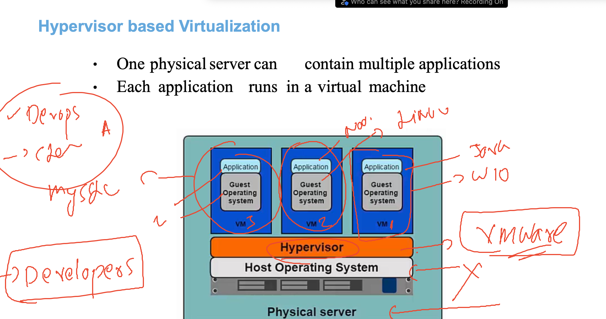

# k8s-cloud4c-b4

## plan


### problem in our past experience


### bare-metal solution using hypervisor with virtualization 



## introduce containers


### introduction container engines 


## Installation 


### docker desktop


### login to remote linux machine from windows powershell using ssh

```

PS C:\Users\humanfirmware> ssh  ashu@43.205.221.152
The authenticity of host '43.205.221.152 (43.205.221.152)' can't be established.
ED25519 key fingerprint is SHA256:3L/XWgBb2uRFS7dX2R8hCmhGnAwuLiG9UY3W1IBqLzU.
This key is not known by any other names
Are you sure you want to continue connecting (yes/no/[fingerprint])? yes
Warning: Permanently added '43.205.221.152' (ED25519) to the list of known hosts.
ashu@43.205.221.152's password:

       __|  __|_  )
       _|  (     /   Amazon Linux 2 AMI
      ___|\___|___|

https://aws.amazon.com/amazon-linux-2/
[ashu@ip-172-31-9-111 ~]$ whoami
ashu
[ashu@ip-172-31-9-111 ~]$


```


