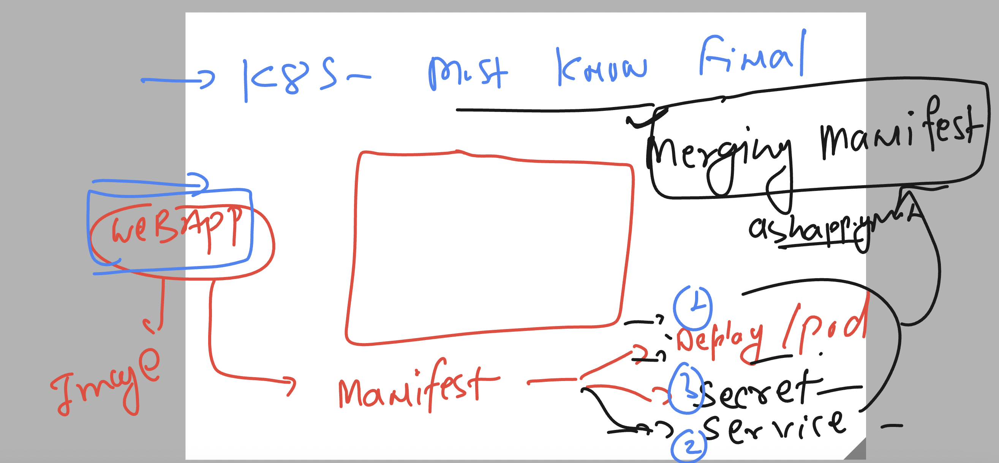

# k8s-cloud4c-b4

### connecting to lab and cleaning everything in personal namespace

```
[ashu@ip-172-31-9-111 ashu-apps]$ kubectl  config  get-contexts 
CURRENT   NAME                          CLUSTER      AUTHINFO           NAMESPACE
*         kubernetes-admin@kubernetes   kubernetes   kubernetes-admin   ashu-space

[ashu@ip-172-31-9-111 ashu-apps]$ kubectl  delete all --all
pod "ashu-db" deleted

[ashu@ip-172-31-9-111 ashu-apps]$ kubectl  delete secret  --all
secret "ashu-db-pass" deleted
secret "ashu-reg-cred" deleted
[ashu@ip-172-31-9-111 ashu-apps]$ 
```

### overall default is the namespace where we all connect by default as starting user


### checking resource of any other namespace --  If you have permission 

```
[ashu@ip-172-31-9-111 ashu-apps]$ kubectl   get  deployment   
No resources found in ashu-space namespace.
[ashu@ip-172-31-9-111 ashu-apps]$

[ashu@ip-172-31-9-111 ashu-apps]$ kubectl  config get-contexts 
CURRENT   NAME                          CLUSTER      AUTHINFO           NAMESPACE
*         kubernetes-admin@kubernetes   kubernetes   kubernetes-admin   ashu-space

[ashu@ip-172-31-9-111 ashu-apps]$ 
[ashu@ip-172-31-9-111 ashu-apps]$ 
[ashu@ip-172-31-9-111 ashu-apps]$ whoami
ashu


[ashu@ip-172-31-9-111 ashu-apps]$ kubectl   get  deployment    -n  kubernetes-dashboard  
NAME                        READY   UP-TO-DATE   AVAILABLE   AGE
dashboard-metrics-scraper   1/1     1            1           3d8h
kubernetes-dashboard        1/1     1            1           3d8h


[ashu@ip-172-31-9-111 ashu-apps]$ 
[ashu@ip-172-31-9-111 ashu-apps]$ kubectl   -n  kubernetes-dashboard    get  deployment 
NAME                        READY   UP-TO-DATE   AVAILABLE   AGE
dashboard-metrics-scraper   1/1     1            1           3d8h
kubernetes-dashboard        1/1     1            1           3d8h
[ashu@ip-172-31-9-111 ashu-apps]$ 
```

### targeting any Resource to any other namespace 


### merging manifest 



### deployment , service , secret --merged
---
ashu-app-deploy.yaml
---
```
# deployment manifest 
apiVersion: apps/v1
kind: Deployment
metadata:
  creationTimestamp: null
  labels:
    app: ashu-app
  name: ashu-app
spec:
  replicas: 1
  selector:
    matchLabels:
      app: ashu-app
  strategy: {}
  template: # for creating pod 
    metadata:
      creationTimestamp: null
      labels: # label of pods 
        app: ashu-app
    spec:
      imagePullSecrets: # calling secret 
      - name: ashu-img-secre # name of secret 
      containers:
      - image: cloud4c.azurecr.io/day10-web:uiv1
        name: day10-web
        ports:
        - containerPort: 80
        resources: {}
status: {}
# creating service of nodeport type manifest
---
apiVersion: v1
kind: Service
metadata:
  creationTimestamp: null
  labels:
    app: ashu-lb10
  name: ashu-lb10
spec:
  ports:
  - name: 80-80
    port: 80
    protocol: TCP
    targetPort: 80
  selector: # pod finder using pod label 
    app: ashu-app # label of pod 
  type: NodePort
status:
  loadBalancer: {}

# create secret manifest which will be used by deployment 
---
apiVersion: v1
data:
  .dockerconfigjson: eyJhdXRocyI6eyJjbG91ZDRjLmF6dXJlY3IuaW8iOnsidXNlcm5hbWUiOiJjbG91ZDRjIiwicGFzc3dvcmQiOiI5MnhQREk1cC9Qc1YzWlFKSDZhcXAybHIvYTVNZlVlczR1bXJPbnlZV0QrQUNSQ25hYmRvIiwiYXV0aCI6IlkyeHZkV1EwWXpvNU1uaFFSRWsxY0M5UWMxWXpXbEZLU0RaaGNYQXliSEl2WVRWTlpsVmxjelIxYlhKUGJubFpWMFFyUVVOU1EyNWhZbVJ2In19fQ==
kind: Secret
metadata:
  creationTimestamp: null
  name: ashu-img-secre # name of secret 
type: kubernetes.io/dockerconfigjson
```

### lets deploy it 

```
[ashu@ip-172-31-9-111 ashu-k8s-manifest]$ kubectl  create -f ashu-app-deploy.yaml 
deployment.apps/ashu-app created
service/ashu-lb10 created
secret/ashu-img-secre created
[ashu@ip-172-31-9-111 ashu-k8s-manifest]$ kubectl   get  deploy
NAME       READY   UP-TO-DATE   AVAILABLE   AGE
ashu-app   1/1     1            1           19s
[ashu@ip-172-31-9-111 ashu-k8s-manifest]$ kubectl  get svc
NAME        TYPE       CLUSTER-IP      EXTERNAL-IP   PORT(S)        AGE
ashu-lb10   NodePort   10.97.210.225   <none>        80:30378/TCP   21s
[ashu@ip-172-31-9-111 ashu-k8s-manifest]$ kubectl  get secrets 
NAME             TYPE                             DATA   AGE
ashu-img-secre   kubernetes.io/dockerconfigjson   1      25s
[ashu@ip-172-31-9-111 ashu-k8s-manifest]$ 
```

### cleaning up

```
ashu@ip-172-31-9-111 ashu-k8s-manifest]$ kubectl  get  secret
NAME             TYPE                             DATA   AGE
ashu-img-secre   kubernetes.io/dockerconfigjson   1      11m
[ashu@ip-172-31-9-111 ashu-k8s-manifest]$ 
[ashu@ip-172-31-9-111 ashu-k8s-manifest]$ kubectl  get svc
NAME        TYPE       CLUSTER-IP      EXTERNAL-IP   PORT(S)        AGE
ashu-lb10   NodePort   10.97.210.225   <none>        80:30378/TCP   11m
[ashu@ip-172-31-9-111 ashu-k8s-manifest]$ kubectl  get deploy
NAME       READY   UP-TO-DATE   AVAILABLE   AGE
ashu-app   1/1     1            1           12m


[ashu@ip-172-31-9-111 ashu-k8s-manifest]$ kubectl  delete -f ashu-app-deploy.yaml 
deployment.apps "ashu-app" deleted
service "ashu-lb10" deleted
secret "ashu-img-secre" deleted
[ashu@ip-172-31-9-111 ashu-k8s-manifest]$ 

```


