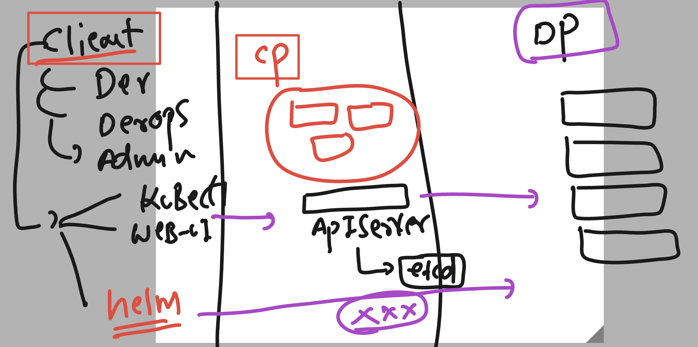
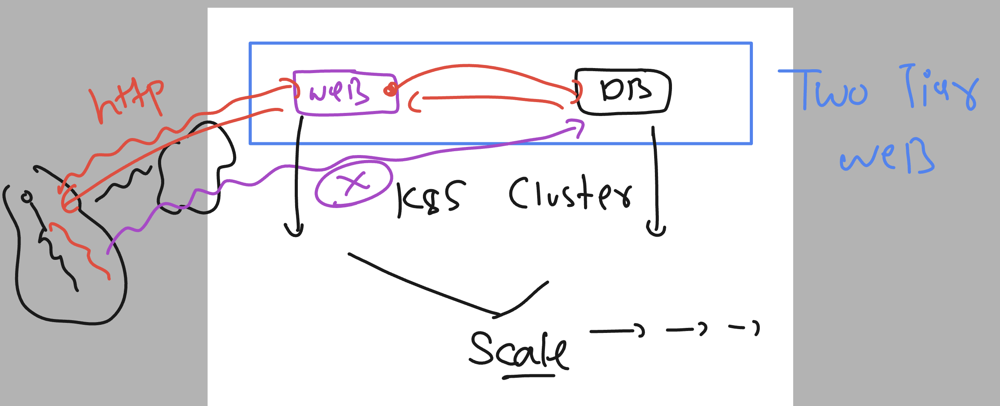

# k8s-cloud4c-b4

### Revision 



### Project 1 



### planning database mysql deployment 

### creating manifest of db deployment 

```
[ashu@ip-172-31-9-111 ashu-apps]$ mkdir  day11-project 
[ashu@ip-172-31-9-111 ashu-apps]$ ls
ashu-k8s-manifest  day11-project  day7-app  java-app  labs.txt  node-app  python-app  ui-app
[ashu@ip-172-31-9-111 ashu-apps]$ cd  day11-project/


[ashu@ip-172-31-9-111 day11-project]$ kubectl   create  deployment  ashu-db --image=mysql:8.0 --port 3306 --dry-run=client  -o yaml  >db_deploy.yaml

```


