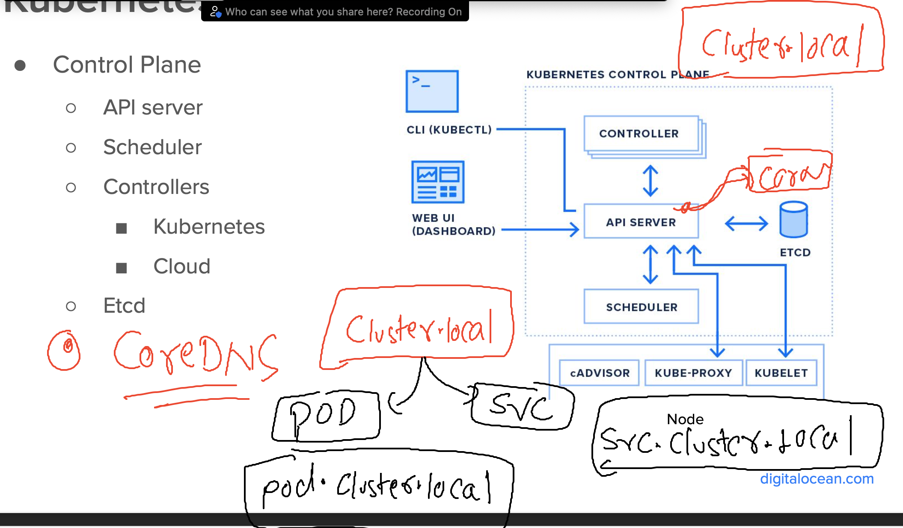

# k8s-cloud4c-b4

### revision 


### verify database things 

```
[ashu@ip-172-31-9-111 ashu-apps]$ kubectl config get-contexts 
CURRENT   NAME                          CLUSTER      AUTHINFO           NAMESPACE
*         kubernetes-admin@kubernetes   kubernetes   kubernetes-admin   ashu-space
[ashu@ip-172-31-9-111 ashu-apps]$ kubectl  get  deploy
NAME      READY   UP-TO-DATE   AVAILABLE   AGE
ashu-db   1/1     1            1           23h
[ashu@ip-172-31-9-111 ashu-apps]$ kubectl  get secret
NAME               TYPE     DATA   AGE
ashu-user-cred     Opaque   2      23h
ashudb-root-cred   Opaque   1      23h
[ashu@ip-172-31-9-111 ashu-apps]$ kubectl  get svc
NAME         TYPE        CLUSTER-IP      EXTERNAL-IP   PORT(S)    AGE
ashu-db-lb   ClusterIP   10.96.101.231   <none>        3306/TCP   22h
[ashu@ip-172-31-9-111 ashu-apps]$ 
```

### updating mysql manifest file to create database initially

```
apiVersion: apps/v1
kind: Deployment
metadata:
  creationTimestamp: null
  labels:
    app: ashu-db
  name: ashu-db
spec:
  replicas: 1
  selector:
    matchLabels:
      app: ashu-db
  strategy: {}
  template:
    metadata:
      creationTimestamp: null
      labels:
        app: ashu-db
    spec:
      containers:
      - image: mysql:8.0
        name: mysql
        ports:
        - containerPort: 3306
        resources: {}
        env: 
        - name: MYSQL_DATABASE  # to create a database 
          value: wordpress # name of database 
        - name: MYSQL_ROOT_PASSWORD # variable to store mysql admin cred 
          valueFrom:
            secretKeyRef: # reading password from secret 
              name: ashudb-root-cred
              key: ashukey1 
        envFrom:
        - secretRef:
            name: ashu-user-cred # name of the secret 
status: {}

```

### apply it 

```
[ashu@ip-172-31-9-111 ashu-apps]$ cd day11-project/
[ashu@ip-172-31-9-111 day11-project]$ ls
db_deploy.yaml  dbsvc.yaml  root_cred.yaml  user_cred.yaml
[ashu@ip-172-31-9-111 day11-project]$ kubectl  apply -f db_deploy.yaml 
deployment.apps/ashu-db configured
[ashu@ip-172-31-9-111 day11-project]$ kubectl  get  po 
NAME                       READY   STATUS    RESTARTS   AGE
ashu-db-5b6f4c7c59-vl8c9   1/1     Running   0          7s
[ashu@ip-172-31-9-111 day11-project]$ 
```

## webapp --deployment part 

### creating manifest file 

```
 kubectl  create  deployment  ashu-webapp --image=wordpress:6.2.1-apache  --port 80 --dry-run=client -o yaml  >webapp_deploy.yaml
```

### updating manifest with db host 

```
apiVersion: apps/v1
kind: Deployment
metadata:
  creationTimestamp: null
  labels:
    app: ashu-webapp
  name: ashu-webapp
spec:
  replicas: 1
  selector:
    matchLabels:
      app: ashu-webapp
  strategy: {}
  template:
    metadata:
      creationTimestamp: null
      labels:
        app: ashu-webapp
    spec:
      containers:
      - image: wordpress:6.2.1-apache
        name: wordpress
        ports:
        - containerPort: 80
        resources: {}
        env: # call env data
        - name: WORDPRESS_DB_HOST
          value: ashu-db-lb # name of the servcie 
status: {}

```

### CoreDNS understanding 



### kube-system is the namespace to check k8s internal component 

```
[ashu@ip-172-31-9-111 day11-project]$ kubectl  get  ns  | grep kube
kube-node-lease        Active   13d
kube-public            Active   13d
kube-system            Active   13d
kubernetes-dashboard   Active   7d8h
[ashu@ip-172-31-9-111 day11-project]$ kubectl  get  po -n kube-system 
NAME                                       READY   STATUS    RESTARTS       AGE
calico-kube-controllers-6c99c8747f-r4ghn   1/1     Running   18 (51m ago)   13d
calico-node-hm9dh                          1/1     Running   19 (51m ago)   13d
calico-node-j76x4                          1/1     Running   19 (51m ago)   13d
calico-node-jlvpf                          1/1     Running   19 (51m ago)   13d
calico-node-tbj8x                          1/1     Running   19 (51m ago)   13d
coredns-5d78c9869d-gnznw                   1/1     Running   19 (51m ago)   13d
coredns-5d78c9869d-xvgn7                   1/1     Running   19 (51m ago)   13d
```

### updating other details as well

```
apiVersion: apps/v1
kind: Deployment
metadata:
  creationTimestamp: null
  labels:
    app: ashu-webapp
  name: ashu-webapp
spec:
  replicas: 1
  selector:
    matchLabels:
      app: ashu-webapp
  strategy: {}
  template:
    metadata:
      creationTimestamp: null
      labels:
        app: ashu-webapp
    spec:
      containers:
      - image: wordpress:6.2.1-apache
        name: wordpress
        ports:
        - containerPort: 80
        resources: {}
        env: # call env data
        - name: WORDPRESS_DB_HOST
          value: ashu-db-lb # name of the servcie 
        - name: WORDPRESS_DB_NAME
          value: wordpress 
        envFrom:
        - secretRef:
            name: ashu-user-cred1
status: {}

```

### make sure you have secret 

```
apiVersion: v1
data:
  WORDPRESS_DB_PASSWORD: SGVsbG9AMTIz
  WORDPRESS_DB_USER: YXNodQ==
kind: Secret
metadata:
  creationTimestamp: null
  name: ashu-user-cred1

```

### apply 

```

```
