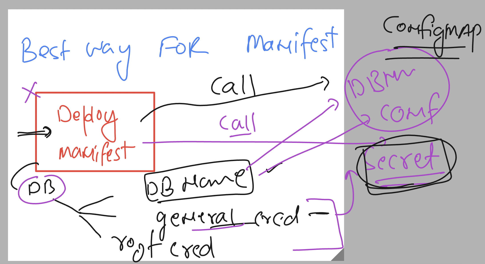

# k8s-cloud4c-b4

### using secret & configmap to call deployment manifest 



### using configmap to store db name info 

```
[ashu@ip-172-31-9-111 day11-project]$ kubectl  create configmap  ashu-db-name --from-literal  ashudbn="wordpress"  --dry-run=client -o yaml  >db-info.yaml
[ashu@ip-172-31-9-111 day11-project]$ kubectl  create -f db-info.yaml 
configmap/ashu-db-name created
[ashu@ip-172-31-9-111 day11-project]$ kubectl  get configmaps 
NAME               DATA   AGE
ashu-db-name       1      4s
kube-root-ca.crt   1      12m
[ashu@ip-172-31-9-111 day11-project]$ 
```

### updating manifest with configmap 

```
apiVersion: apps/v1
kind: Deployment
metadata:
  creationTimestamp: null
  labels:
    app: ashu-db
  name: ashu-db
spec:
  replicas: 1
  selector:
    matchLabels:
      app: ashu-db
  strategy: {}
  template:
    metadata:
      creationTimestamp: null
      labels:
        app: ashu-db
    spec:
      containers:
      - image: mysql:8.0
        name: mysql
        ports:
        - containerPort: 3306
        resources: {}
        env: 
        - name: MYSQL_DATABASE  # to create a database 
          valueFrom: # reading value 
            configMapKeyRef: # configmap 
              name: ashu-db-name # name of cm 
              key: ashudbn  # key of cm 
        - name: MYSQL_ROOT_PASSWORD # variable to store mysql admin cred 
          valueFrom:
            secretKeyRef: # reading password from secret 
              name: ashudb-root-cred
              key: ashukey1 
        envFrom:
        - secretRef:
            name: ashu-user-cred # name of the secret 
status: {}

```

