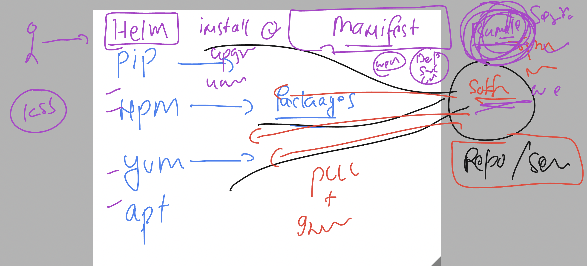
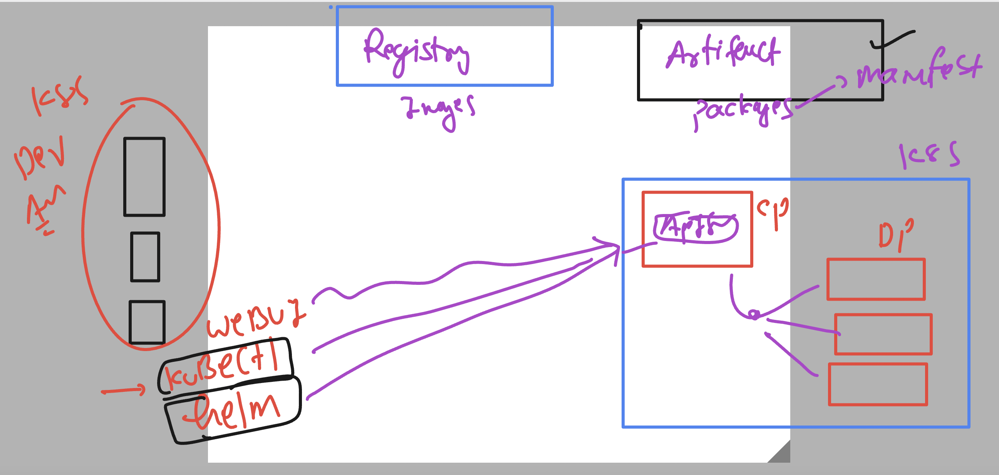
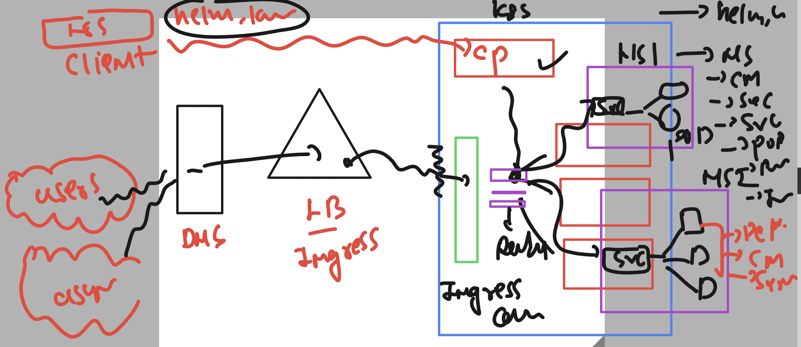
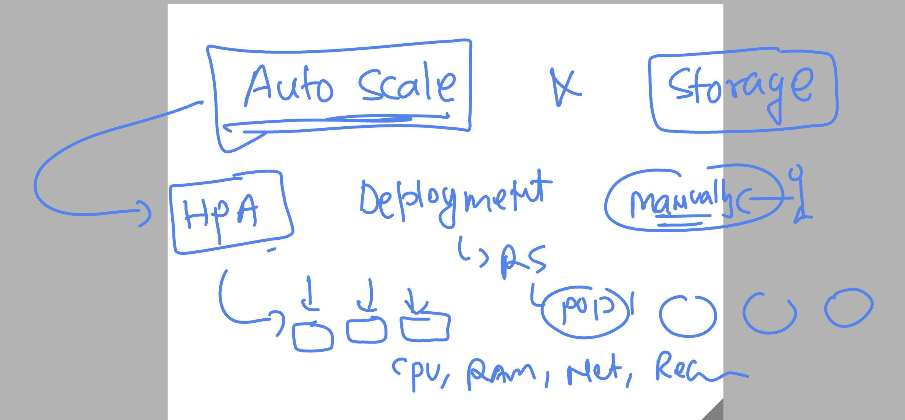

# k8s-cloud4c-b4

### cleaning namespace data

```
[ashu@ip-172-31-9-111 ashu-apps]$ kubectl config get-contexts 
CURRENT   NAME                          CLUSTER      AUTHINFO           NAMESPACE
*         kubernetes-admin@kubernetes   kubernetes   kubernetes-admin   ashu-space
[ashu@ip-172-31-9-111 ashu-apps]$ kubectl  delete all,secret,cm,ingress --all
pod "ashu-db-84566c54f4-klf2z" deleted
pod "ashu-webapp-7d89dcb8b8-8hbdw" deleted
service "ashu-db-lb" deleted
service "ashulb1" deleted
deployment.apps "ashu-db" deleted
deployment.apps "ashu-webapp" deleted
secret "ashu-user-cred" deleted
secret "ashu-user-cred1" deleted
secret "ashudb-root-cred" deleted
configmap "ashu-db-name" deleted
configmap "ashu-web-config" deleted
configmap "kube-root-ca.crt" deleted
[ashu@ip-172-31-9-111 ashu-apps]$ 


```

## HElm package manager for k8s 



### a better understanding of k8s env 



### checking helm version -- we are working with version 3 

```
[ashu@ip-172-31-9-111 day11-project]$ chmod  400  /home/ashu/.kube/config
[ashu@ip-172-31-9-111 day11-project]$ 
[ashu@ip-172-31-9-111 day11-project]$ helm version 
version.BuildInfo{Version:"v3.12.2", GitCommit:"1e210a2c8cc5117d1055bfaa5d40f51bbc2e345e", GitTreeState:"clean", GoVersion:"go1.20.5"}
[ashu@ip-172-31-9-111 day11-project]$
```

### adding repo in helm database

```
[ashu@ip-172-31-9-111 day11-project]$ helm repo add   ashu-repo  https://charts.bitnami.com/bitnami
"ashu-repo" has been added to your repositories
[ashu@ip-172-31-9-111 day11-project]$ 
[ashu@ip-172-31-9-111 day11-project]$ 
[ashu@ip-172-31-9-111 day11-project]$ helm repo ls
NAME            URL                               
ashu-repo       https://charts.bitnami.com/bitnami
[ashu@ip-172-31-9-111 day11-project]$ 
```

### search package in repo 

```
[ashu@ip-172-31-9-111 day11-project]$ helm search  repo  nginx 
NAME                                    CHART VERSION   APP VERSION     DESCRIPTION                                       
ashu-repo/nginx                         15.1.2          1.25.1          NGINX Open Source is a web server that can be a...
ashu-repo/nginx-ingress-controller      9.7.7           1.8.1           NGINX Ingress Controller is an Ingress controll...
ashu-repo/nginx-intel                   2.1.15          0.4.9           DEPRECATED NGINX Open Source for Intel is a lig...
new-repo/nginx-ingress                  1.41.3          v0.34.1         DEPRECATED! An nginx Ingress controller that us...
new-repo/nginx-ldapauth-proxy           0.1.6           1.13.5          DEPRECATED - nginx proxy with ldapauth            
new-repo/nginx-lego                     0.3.1                           Chart for nginx-ingress-controller and kube-lego  
new-repo/gcloud-endpoints               0.1.2           1               DEPRECATED Develop, deploy, protect and monitor...
[ashu@ip-172-31-9-111 day11-project]$ 

```

### lets deploy nginx web service using helm

```
[ashu@ip-172-31-9-111 day11-project]$ helm install  ashu-web    ashu-repo/nginx 
NAME: ashu-web
LAST DEPLOYED: Thu Aug  3 12:19:43 2023
NAMESPACE: ashu-space
STATUS: deployed
REVISION: 1
TEST SUITE: None
NOTES:
CHART NAME: nginx
CHART VERSION: 15.1.2
APP VERSION: 1.25.1

** Please be patient while the chart is being deployed **
NGINX can be accessed through the following DNS name from within your cluster:

    ashu-web-nginx.ashu-space.svc.cluster.local (port 80)

To access NGINX from outside the cluster, follow the steps below:

1. Get the NGINX URL by running these commands:

  NOTE: It may take a few minutes for the LoadBalancer IP to be available.
        Watch the status with: 'kubectl get svc --namespace ashu-space -w ashu-web-nginx'

    export SERVICE_PORT=$(kubectl get --namespace ashu-space -o jsonpath="{.spec.ports[0].port}" services ashu-web-nginx)
    export SERVICE_IP=$(kubectl get svc --namespace ashu-space ashu-web-nginx -o jsonpath='{.status.loadBalancer.ingress[0].ip}')
    echo "http://${SERVICE_IP}:${SERVICE_PORT}"
[ashu@ip-172-31-9-111 day11-project]$ 
```

### list of deployed packages

```
[ashu@ip-172-31-9-111 day11-project]$ helm list
NAME            NAMESPACE       REVISION        UPDATED                                 STATUS          CHART           APP VERSION
ashu-web        ashu-space      1               2023-08-03 12:19:43.312666479 +0000 UTC deployed        nginx-15.1.2    1.25.1     
[ashu@ip-172-31-9-111 day11-project]$ 
```

### verify by kubectl

```
[ashu@ip-172-31-9-111 day11-project]$ kubectl  get  deploy
NAME             READY   UP-TO-DATE   AVAILABLE   AGE
ashu-web-nginx   1/1     1            1           82s
[ashu@ip-172-31-9-111 day11-project]$ 
[ashu@ip-172-31-9-111 day11-project]$ kubectl  get  po
NAME                              READY   STATUS    RESTARTS   AGE
ashu-web-nginx-86789667fc-jn4fb   1/1     Running   0          90s
[ashu@ip-172-31-9-111 day11-project]$ kubectl  get  svc
NAME             TYPE           CLUSTER-IP      EXTERNAL-IP   PORT(S)        AGE
ashu-web-nginx   LoadBalancer   10.110.26.180   <pending>     80:31703/TCP   92s
```

### uninstall deployed package

```
[ashu@ip-172-31-9-111 day11-project]$ helm ls
NAME            NAMESPACE       REVISION        UPDATED                                 STATUS          CHART           APP VERSION
ashu-web        ashu-space      1               2023-08-03 12:19:43.312666479 +0000 UTC deployed        nginx-15.1.2    1.25.1     
[ashu@ip-172-31-9-111 day11-project]$ 
[ashu@ip-172-31-9-111 day11-project]$ helm uninstall  ashu-web
release "ashu-web" uninstalled
[ashu@ip-172-31-9-111 day11-project]$ helm ls
NAME    NAMESPACE       REVISION        UPDATED STATUS  CHART   APP VERSION
[ashu@ip-172-31-9-111 day11-project]$ 
[ashu@ip-172-31-9-111 day11-project]$ kubectl  get  all
No resources found in ashu-space namespace.
[ashu@ip-172-31-9-111 day11-project]$ 

```

### k8s overall



### Introduction to HPA in k8s



### creating sample app for testing auto scaling 

```
[ashu@ip-172-31-9-111 ashu-apps]$ mkdir  hpa
[ashu@ip-172-31-9-111 ashu-apps]$ cd hpa/
[ashu@ip-172-31-9-111 hpa]$ kubectl   create  deployment  ashu-webapp --image=dockerashu/reactapp:version1 --port 3000 --dry-run=client -o yaml  >deploy.yaml 
[ashu@ip-172-31-9-111 hpa]$ ls
deploy.yaml
[ashu@ip-172-31-9-111 hpa]$ 
```

### modify manifest file

```
apiVersion: apps/v1
kind: Deployment
metadata:
  creationTimestamp: null
  labels:
    app: ashu-webapp
  name: ashu-webapp
spec:
  replicas: 1
  selector:
    matchLabels:
      app: ashu-webapp
  strategy: {}
  template: # template 
    metadata:
      creationTimestamp: null
      labels:
        app: ashu-webapp
    spec:
      containers:
      - image: dockerashu/reactapp:version1
        name: reactapp
        ports:
        - containerPort: 3000
        resources: 
          requests: # manadotary process for HPA 
            memory: 100M
            cpu: 100m  #  1 core cpu = 1000m (mili core)
          limits:
            memory: 400M # max allowed ram 
            cpu: 200m # max allowed CPU 
status: {}

```

### Deploy manifest

```
ashu@ip-172-31-9-111 hpa]$ kubectl  apply -f deploy.yaml 
deployment.apps/ashu-webapp created
[ashu@ip-172-31-9-111 hpa]$ kubectl  get  deploy
NAME          READY   UP-TO-DATE   AVAILABLE   AGE
ashu-webapp   1/1     1            1           5s
[ashu@ip-172-31-9-111 hpa]$ kubectl  get  po 
NAME                          READY   STATUS    RESTARTS   AGE
ashu-webapp-d9cb6cb7c-8j484   1/1     Running   0          7s
[ashu@ip-172-31-9-111 hpa]$ 
```

### exposing ti using Nodeport 

```
apiVersion: v1
kind: Service
metadata:
  creationTimestamp: null
  labels:
    app: ashu-webapp
  name: lb1
spec:
  ports:
  - port: 3000
    protocol: TCP
    targetPort: 3000
  selector:
    app: ashu-webapp
  type: NodePort
status:
  loadBalancer: {}

```

### app

```
[ashu@ip-172-31-9-111 hpa]$ kubectl  get svc
NAME   TYPE       CLUSTER-IP       EXTERNAL-IP   PORT(S)          AGE
lb1    NodePort   10.106.194.175   <none>        3000:30856/TCP   101s
[ashu@ip-172-31-9-111 hpa]$ 

```

### creating HPA rule in manifest

```
[ashu@ip-172-31-9-111 hpa]$ kubectl  get  deploy
NAME          READY   UP-TO-DATE   AVAILABLE   AGE
ashu-webapp   1/1     1            1           5m16s
[ashu@ip-172-31-9-111 hpa]$ kubectl  autoscale  deployment  ashu-webapp  --min 2 --max 20 --cpu-percent 80 --dry-run=client -o yaml >autoscale.yaml 
[ashu@ip-172-31-9-111 hpa]$ 
```

### Deploy HPA manifest

```
[ashu@ip-172-31-9-111 hpa]$ kubectl  apply -f autoscale.yaml 
horizontalpodautoscaler.autoscaling/ashu-webapp created
[ashu@ip-172-31-9-111 hpa]$ kubectl  get  hpa
NAME          REFERENCE                TARGETS         MINPODS   MAXPODS   REPLICAS   AGE
ashu-webapp   Deployment/ashu-webapp   <unknown>/80%   2         20        0          3s
[ashu@ip-172-31-9-111 hpa]$ kubectl  get  hpa
NAME          REFERENCE                TARGETS         MINPODS   MAXPODS   REPLICAS   AGE
ashu-webapp   Deployment/ashu-webapp   <unknown>/80%   2         20        1          24s
[ashu@ip-172-31-9-111 hpa]$ kubectl  get po
NAME                          READY   STATUS    RESTARTS   AGE
ashu-webapp-d9cb6cb7c-8j484   1/1     Running   0          13m
ashu-webapp-d9cb6cb7c-qmsxr   1/1     Running   0          13s
[ashu@ip-172-31-9-111 hpa]$ 
```


