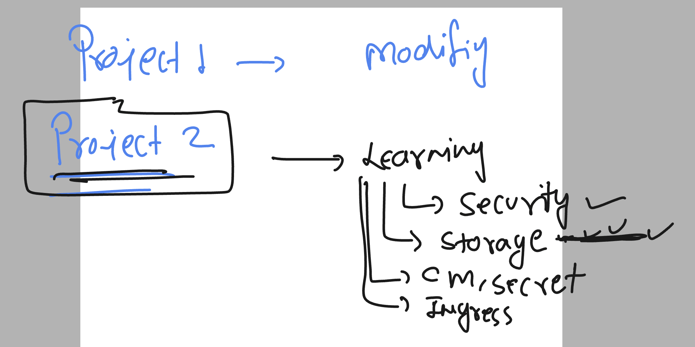
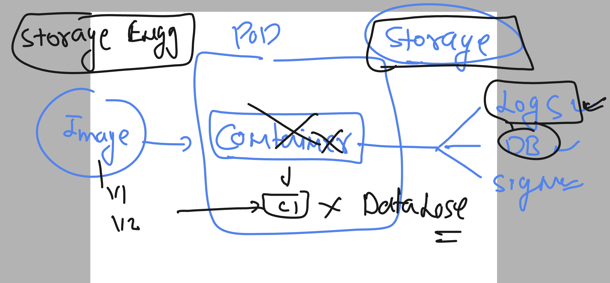

# k8s-cloud4c-b4

### Project 2



### Introduction to need to external Storage to the container 



### testing the need of storage

```
[ashu@ip-172-31-9-111 ashu-apps]$ mkdir  day15-storage-check 
[ashu@ip-172-31-9-111 ashu-apps]$ cd day15-storage-check/
[ashu@ip-172-31-9-111 day15-storage-check]$ 
[ashu@ip-172-31-9-111 day15-storage-check]$ 
[ashu@ip-172-31-9-111 day15-storage-check]$ kubectl  create deployment  ashudb --image=mysql:8.0 --port 3306 --dry-run=client    -o yaml >deploy.yaml
```

### creating env file to store varibles info 
### dbname.env

```
MYSQL_DATABASE="ashudb"
```

### creating configmap using above env

```
 kubectl  create configmap  ashu-cm --from-env-file dbname.env  --dry-run=client -o yaml >cm.yaml

====>
[ashu@ip-172-31-9-111 day15-storage-check]$ kubectl  apply -f cm.yaml 
configmap/ashu-cm created
[ashu@ip-172-31-9-111 day15-storage-check]$ kubectl  get  cm 
NAME               DATA   AGE
ashu-cm            1      4s
kube-root-ca.crt   1      15m
```

### creating secret to store cred

```
[ashu@ip-172-31-9-111 day15-storage-check]$ kubectl  create secret  generic  ashu-db-cred --from-env-file  dbcred.env   --dry-run=client  -o yaml >secret.yaml 
[ashu@ip-172-31-9-111 day15-storage-check]$ kubectl  apply -f secret.yaml 
secret/ashu-db-cred created
[ashu@ip-172-31-9-111 day15-storage-check]$ kubectl  get secret
NAME           TYPE     DATA   AGE
ashu-db-cred   Opaque   3      6s
[ashu@ip-172-31-9-111 day15-storage-check]$ 
```

### dbcred.env

```
MYSQL_ROOT_PASSWORD="Root@db098"
MYSQL_USER="ashu"
MYSQL_PASSWORD="AshuDb@123"
```

### updating deployment manifest to consume configmap and secret 

```
apiVersion: apps/v1
kind: Deployment
metadata:
  creationTimestamp: null
  labels:
    app: ashudb
  name: ashudb
spec:
  replicas: 1
  selector:
    matchLabels:
      app: ashudb
  strategy: {}
  template:
    metadata:
      creationTimestamp: null
      labels:
        app: ashudb
    spec:
      containers:
      - image: mysql:8.0
        name: mysql
        ports:
        - containerPort: 3306
        resources: {}
        envFrom:
        - secretRef:
            name: ashu-db-cred
        - configMapRef:
            name: ashu-cm

status: {}

```

### lets deploy it

```
[ashu@ip-172-31-9-111 day15-storage-check]$ kubectl  apply -f deploy.yaml 
deployment.apps/ashudb created
[ashu@ip-172-31-9-111 day15-storage-check]$ kubectl  get deploy
NAME     READY   UP-TO-DATE   AVAILABLE   AGE
ashudb   1/1     1            1           4s
[ashu@ip-172-31-9-111 day15-storage-check]$ kubectl  get po
NAME                      READY   STATUS    RESTARTS   AGE
ashudb-597564c847-q6rw6   1/1     Running   0          8s
[ashu@ip-172-31-9-111 day15-storage-check]$ 


```


