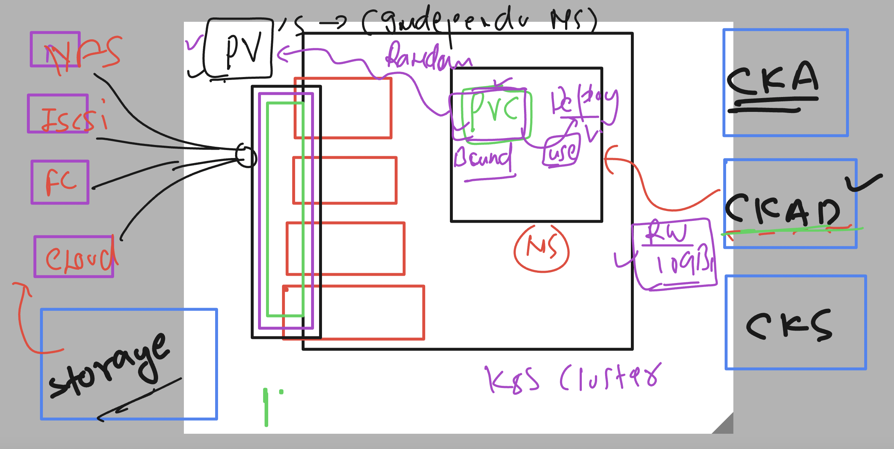

# k8s-cloud4c-b4

### connecting to Lab 

```
[ashu@ip-172-31-9-111 ashu-apps]$ kubectl config get-contexts 
CURRENT   NAME                          CLUSTER      AUTHINFO           NAMESPACE
*         kubernetes-admin@kubernetes   kubernetes   kubernetes-admin   ashu-space

[ashu@ip-172-31-9-111 ashu-apps]$ kubectl delete all,cm,secret --all
pod "ashudb-66cb7c8599-pxqkp" deleted
deployment.apps "ashudb" deleted
configmap "ashu-cm" deleted
configmap "kube-root-ca.crt" deleted
secret "ashu-db-cred" deleted
[ashu@ip-172-31-9-111 ashu-apps]$ 
```

### PV and PVC in k8s 



