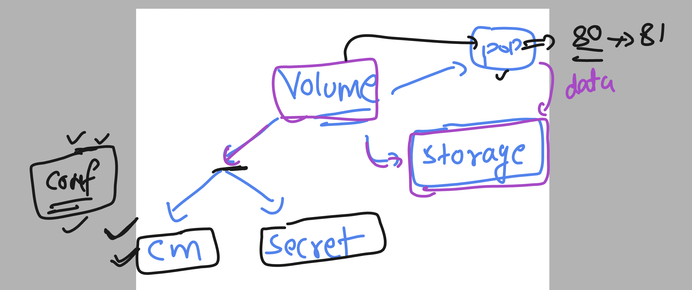
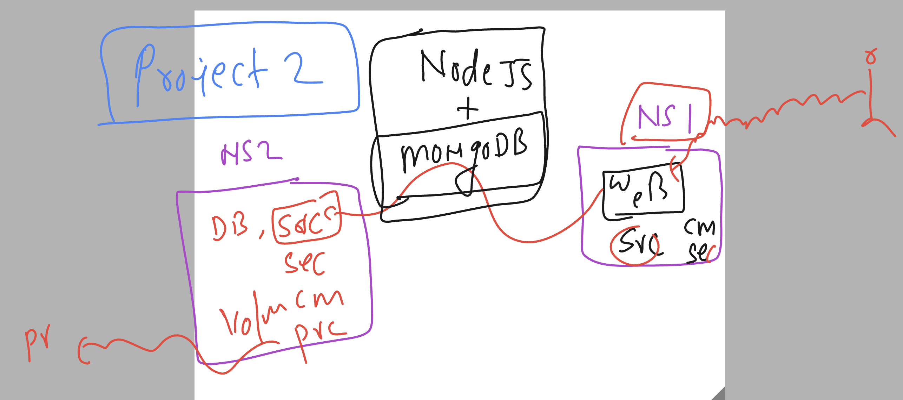

# k8s-cloud4c-b4

### connecting to Lab 

```
[ashu@ip-172-31-9-111 ashu-apps]$ kubectl config get-contexts 
CURRENT   NAME                          CLUSTER      AUTHINFO           NAMESPACE
*         kubernetes-admin@kubernetes   kubernetes   kubernetes-admin   ashu-space

[ashu@ip-172-31-9-111 ashu-apps]$ kubectl delete all,cm,secret --all
pod "ashudb-66cb7c8599-pxqkp" deleted
deployment.apps "ashudb" deleted
configmap "ashu-cm" deleted
configmap "kube-root-ca.crt" deleted
secret "ashu-db-cred" deleted
[ashu@ip-172-31-9-111 ashu-apps]$ 
```

### PV and PVC in k8s 


### another view of volume 



## Creating project -- test

```
[ashu@ip-172-31-9-111 ashu-apps]$ mkdir  day16-pre-project
[ashu@ip-172-31-9-111 ashu-apps]$ cd day16-pre-project/
[ashu@ip-172-31-9-111 day16-pre-project]$ ls
[ashu@ip-172-31-9-111 day16-pre-project]$ kubectl create deploy ashu-secure-app --image=nginx --port 81  --dry-run=client -o yaml  >deploy.yaml 
[ashu@ip-172-31-9-111 day16-pre-project]$ ls
deploy.yaml
```

### creating deployment 

```
[ashu@ip-172-31-9-111 day16-pre-project]$ kubectl create -f deploy.yaml 
deployment.apps/ashu-secure-app created

[ashu@ip-172-31-9-111 day16-pre-project]$ kubectl  get  deploy
NAME              READY   UP-TO-DATE   AVAILABLE   AGE
ashu-secure-app   1/1     1            1           4s

[ashu@ip-172-31-9-111 day16-pre-project]$ kubectl  get  po
NAME                               READY   STATUS    RESTARTS   AGE
ashu-secure-app-596ff799d4-9x6hp   1/1     Running   0          9s
[ashu@ip-172-31-9-111 day16-pre-project]$ 
```


### creating nodeport svc

```
[ashu@ip-172-31-9-111 day16-pre-project]$ kubectl  get  deploy
NAME              READY   UP-TO-DATE   AVAILABLE   AGE
ashu-secure-app   1/1     1            1           48s
[ashu@ip-172-31-9-111 day16-pre-project]$ 
[ashu@ip-172-31-9-111 day16-pre-project]$ kubectl  expose deployment ashu-secure-app --type NodePort --port 81 --name s1 --dry-run=client -o yaml  >svc.yaml
[ashu@ip-172-31-9-111 day16-pre-project]$ kubectl  create -f svc.yaml 
service/s1 created
[ashu@ip-172-31-9-111 day16-pre-project]$ kubectl  get svc
NAME   TYPE       CLUSTER-IP       EXTERNAL-IP   PORT(S)        AGE
s1     NodePort   10.102.173.106   <none>        81:32331/TCP   2s
[ashu@ip-172-31-9-111 day16-pre-project]$ 

```

### creating default.conf along side manifest from the running 

```
[ashu@ip-172-31-9-111 ashu-apps]$ kubectl  get  po
NAME                               READY   STATUS    RESTARTS   AGE
ashu-secure-app-596ff799d4-9x6hp   1/1     Running   0          7m58s
[ashu@ip-172-31-9-111 ashu-apps]$ 
[ashu@ip-172-31-9-111 ashu-apps]$ kubectl  exec -it ashu-secure-app-596ff799d4-9x6hp -- bash 
root@ashu-secure-app-596ff799d4-9x6hp:/# 
root@ashu-secure-app-596ff799d4-9x6hp:/# 
root@ashu-secure-app-596ff799d4-9x6hp:/# cd  /etc/nginx/conf.d/
root@ashu-secure-app-596ff799d4-9x6hp:/etc/nginx/conf.d# ls
default.conf
root@ashu-secure-app-596ff799d4-9x6hp:/etc/nginx/conf.d# cat  default.conf 
server {
    listen       80;
    listen  [::]:80;
    server_name  localhost;

    #access_log  /var/log/nginx/host.access.log  main;

```

### creating configmap using nginx configuration 

### 
```
 795  kubectl create configmap ashu-nginx-conf  --from-file default.conf  --dry-run=client  -o yaml >cm.yaml 
  796  history 
[ashu@ip-172-31-9-111 day16-pre-project]$ ls
cm.yaml  default.conf  deploy.yaml  svc.yaml
[ashu@ip-172-31-9-111 day16-pre-project]$ kubectl create -f cm.yaml 
configmap/ashu-nginx-conf created
[ashu@ip-172-31-9-111 day16-pre-project]$ kubectl  get  cm
NAME               DATA   AGE
ashu-nginx-conf    1      4s
```

### updated deployment manifest 

```
apiVersion: apps/v1
kind: Deployment
metadata:
  creationTimestamp: null
  labels:
    app: ashu-secure-app
  name: ashu-secure-app
spec:
  replicas: 1
  selector:
    matchLabels:
      app: ashu-secure-app
  strategy: {}
  template:
    metadata:
      creationTimestamp: null
      labels:
        app: ashu-secure-app
    spec:
      volumes: # creating volume
      - name: ashu-ng-vol
        configMap: # reading source 
          name: ashu-nginx-conf
      containers:
      - image: nginx
        name: nginx
        ports:
        - containerPort: 81
        resources: {}
        volumeMounts: # using above created volume 
        - name: ashu-ng-vol
          mountPath: /etc/nginx/conf.d/
status: {}

```

### recreated deployment 

```
[ashu@ip-172-31-9-111 day16-pre-project]$ kubectl  replace -f deploy.yaml --force
deployment.apps "ashu-secure-app" deleted
deployment.apps/ashu-secure-app replaced
[ashu@ip-172-31-9-111 day16-pre-project]$ kubectl  get  deploy
NAME              READY   UP-TO-DATE   AVAILABLE   AGE
ashu-secure-app   1/1     1            1           4s
[ashu@ip-172-31-9-111 day16-pre-project]$ kubectl  get  pod
NAME                               READY   STATUS    RESTARTS   AGE
ashu-secure-app-599bbd6685-wp4lk   1/1     Running   0          8s
```

## Creating project 2



### Creating details about Mongodb 

### credfile 

---mongo-cred.env
```
MONGO_INITDB_ROOT_USERNAME=ashu
MONGO_INITDB_ROOT_PASSWORD=AshuDb@098
```

### creating secret using above cred file

```
[ashu@ip-172-31-9-111 day16-mongo-project]$ ls
mongo-cred.env

[ashu@ip-172-31-9-111 day16-mongo-project]$ kubectl  create secret generic  ashu-mongo-cred --from-env-file mongo-cred.env --dry-run=client -o yaml >secret.yaml

[ashu@ip-172-31-9-111 day16-mongo-project]$ ls
mongo-cred.env  secret.yaml

[ashu@ip-172-31-9-111 day16-mongo-project]$ kubectl  create -f secret.yaml 
secret/ashu-mongo-cred created

[ashu@ip-172-31-9-111 day16-mongo-project]$ kubectl  get secrets 
NAME              TYPE     DATA   AGE
ashu-mongo-cred   Opaque   2      4s
[ashu@ip-172-31-9-111 day16-mongo-project]$ 
```

### mongo_deployment.yaml 

```
apiVersion: apps/v1
kind: Deployment
metadata:
  creationTimestamp: null
  labels:
    app: ashu-mongo
  name: ashu-mongo
spec:
  replicas: 1
  selector:
    matchLabels:
      app: ashu-mongo
  strategy: {}
  template:
    metadata:
      creationTimestamp: null
      labels:
        app: ashu-mongo
    spec:
      containers:
      - image: mongo
        name: mongo
        ports:
        - containerPort: 27017
        resources: 
          requests:
            memory: 400M 
            cpu: 200m 
          limits:
            memory: 2G
            cpu: 700m 
        envFrom:
        - secretRef:
            name: ashu-mongo-cred
status: {}

```

### 

```
[ashu@ip-172-31-9-111 day16-mongo-project]$ kubectl  apply -f mongo_deploy.yaml 
deployment.apps/ashu-mongo created
[ashu@ip-172-31-9-111 day16-mongo-project]$ kubectl  get  deploy
NAME         READY   UP-TO-DATE   AVAILABLE   AGE
ashu-mongo   0/1     1            0           3s

[ashu@ip-172-31-9-111 day16-mongo-project]$ kubectl  get  po
NAME                          READY   STATUS              RESTARTS   AGE
ashu-mongo-75cc4796fb-cb4bg   0/1     ContainerCreating   0          6s

[ashu@ip-172-31-9-111 day16-mongo-project]$ kubectl  logs ashu-mongo-75cc4796fb-cb4bg 
Error from server (BadRequest): container "mongo" in pod "ashu-mongo-75cc4796fb-cb4bg" is waiting to start: ContainerCreating

[ashu@ip-172-31-9-111 day16-mongo-project]$ kubectl  get  po
NAME                          READY   STATUS    RESTARTS   AGE
ashu-mongo-75cc4796fb-cb4bg   1/1     Running   0          16s
[ashu@ip-172-31-9-111 day16-mongo-project]$ kubectl  logs ashu-mongo-75cc4796fb-cb4bg 
about to fork child process, waiting until server is ready for connections.
forked process: 27

{"t":{"$date":"2023-08-07T13:14:03.478+00:00"},"s":"I",  "c":"CONTROL",  "id":20698,   "ctx":"-","msg":"***** SERVER RESTARTED *****"}
```

