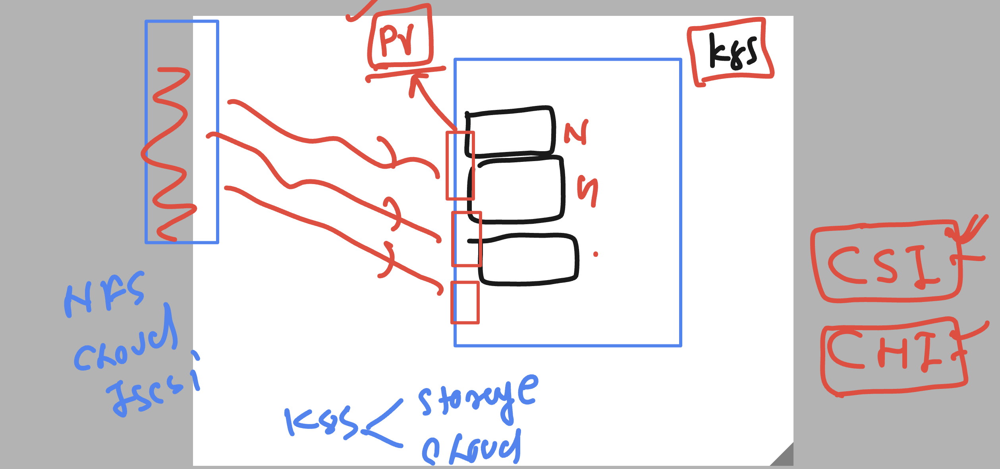

# k8s-cloud4c-b4

### understandign CSI 



### creating PV -- which is going to take storage from External Server

```
apiVersion: v1
kind: PersistentVolume
metadata:
  name: ashu-pv
spec:
  capacity:
    storage: 5Gi # 3Gi  to 10Gi 
  volumeMode: Filesystem
  accessModes:
    - ReadWriteMany # change 1
  storageClassName: manual # change 2 
  nfs:
    path: /data/db-store/ashu/ # source location 
    server: 172.31.9.111 # storage server IP address 
```

### creating pv 

```
 kubectl  create -f ashupv.yaml
===
[ashu@ip-172-31-9-111 day17-testing]$ kubectl  get  pv  | grep -i avai
ashu-pv-newst     5Gi        RWX            Retain           Available                                    manual                  68s
```

### PVC is all about sending request to pv and finding the best match 

```
apiVersion: v1
kind: PersistentVolumeClaim
metadata:
  name: ashu-cliam-new
spec:
  accessModes:
    - ReadWriteMany
  volumeMode: Filesystem
  resources:
    requests:
      storage: 6Gi
  storageClassName: manual 
  
```

### 

```
[ashu@ip-172-31-9-111 day17-testing]$ ls
ashu-pvc.yaml  ashupv.yaml
[ashu@ip-172-31-9-111 day17-testing]$ kubectl  create -f ashu-pvc.yaml 
persistentvolumeclaim/ashu-cliam-new created
[ashu@ip-172-31-9-111 day17-testing]$ kubectl  get  pvc
NAME             STATUS   VOLUME      CAPACITY   ACCESS MODES   STORAGECLASS   AGE
ashu-cliam-new   Bound    mahesh-pv   6Gi        RWX            manual         3s
[ashu@ip-172-31-9-111 day17-testing]$ 
```

### creating deployment 

```
kubectl  create  deployment ashu-dep --image=mysql:8.0 --port 3306 --dry-run=client -o yaml >dbdep.yaml
```

### manifest file for deployment 

```
apiVersion: apps/v1
kind: Deployment
metadata:
  creationTimestamp: null
  labels:
    app: ashu-dep
  name: ashu-dep
spec:
  replicas: 1
  selector:
    matchLabels:
      app: ashu-dep
  strategy: {}
  template:
    metadata:
      creationTimestamp: null
      labels:
        app: ashu-dep
    spec:
      volumes:
      - name: ashu-db-volx1
        persistentVolumeClaim:
          claimName: ashu-cliam-new 
      containers:
      - image: mysql:8.0
        name: mysql
        ports:
        - containerPort: 3306
        resources: {}
        env: 
        - name: MYSQL_ROOT_PASSWORD
          value: RootPass@123
        volumeMounts:
        - name: ashu-db-volx1
          mountPath: /var/lib/mysql/
status: {}

```

### creating it 

```
[ashu@ip-172-31-9-111 day17-testing]$ kubectl  create -f dbdep.yaml 
deployment.apps/ashu-dep created
[ashu@ip-172-31-9-111 day17-testing]$ kubectl  get deploy 
NAME       READY   UP-TO-DATE   AVAILABLE   AGE
ashu-dep   1/1     1            1           4s
[ashu@ip-172-31-9-111 day17-testing]$ kubectl  get po
NAME                       READY   STATUS    RESTARTS   AGE
ashu-dep-f6db987bc-xwtm6   1/1     Running   0          7s
[ashu@ip-172-31-9-111 day17-testing]$ 
```

### Multi contaienr pod 

```
apiVersion: v1
kind: Pod
metadata:
  creationTimestamp: null
  labels:
    run: ashudb
  name: ashudb
spec:
  volumes: 
  - name: ashu-volx9
    hostPath:
      path: /data/new/ashudb
      type: DirectoryOrCreate
  containers:
  - image: alpine 
    name: ashuc1
    command: ['sh','-c','sleep 100000']
    volumeMounts:
    - name: ashu-volx9
      mountPath: /mnt/data/
      readOnly: true 
  - image: mysql
    name: ashudb
    ports:
    - containerPort: 3306
    resources: {}
    env: 
    - name: MYSQL_ROOT_PASSWORD
      value: RootDb@1234
    volumeMounts:
    - name:  ashu-volx9
      mountPath: /var/lib/mysql/
  dnsPolicy: ClusterFirst
  restartPolicy: Always
status: {}

```

### creating it

```
[ashu@ip-172-31-9-111 day17-testing]$ kubectl  create -f task.yaml 
pod/ashudb created
[ashu@ip-172-31-9-111 day17-testing]$ kubectl  get po
NAME                       READY   STATUS              RESTARTS   AGE
ashu-dep-f6db987bc-xwtm6   1/1     Running             0          28m
ashudb                     0/2     ContainerCreating   0          3s
[ashu@ip-172-31-9-111 day17-testing]$ kubectl  get po
NAME                       READY   STATUS              RESTARTS   AGE
ashu-dep-f6db987bc-xwtm6   1/1     Running             0          28m
ashudb                     0/2     ContainerCreating   0          9s
[ashu@ip-172-31-9-111 day17-testing]$ kubectl  get po
NAME                       READY   STATUS    RESTARTS   AGE
ashu-dep-f6db987bc-xwtm6   1/1     Running   0          28m
ashudb                     2/2     Running   0          22s
[ashu@ip-172-31-9-111 day17-testing]$ 
```

### accessing particular container 

```
ashu@ip-172-31-9-111 day17-testing]$ kubectl  get po
NAME                       READY   STATUS    RESTARTS   AGE
ashu-dep-f6db987bc-xwtm6   1/1     Running   0          32m
ashudb                     2/2     Running   0          3m59s
[ashu@ip-172-31-9-111 day17-testing]$ 
[ashu@ip-172-31-9-111 day17-testing]$ kubectl  exec -it ashudb  -- sh 
Defaulted container "ashuc1" out of: ashuc1, ashudb
/ # 
/ # ls
bin    etc    lib    mnt    proc   run    srv    tmp    var
dev    home   media  opt    root   sbin   sys    usr
/ # cd  /mnt/data/
/mnt/data # ls
#ib_16384_0.dblwr   binlog.000002       ib_buffer_pool      performance_schema  undo_001
#ib_16384_1.dblwr   binlog.index        ibdata1             private_key.pem     undo_002
#innodb_redo        ca-key.pem          ibtmp1              public_key.pem
#innodb_temp        ca.pem              mysql               server-cert.pem
auto.cnf            client-cert.pem     mysql.ibd           server-key.pem
binlog.000001       client-key.pem      mysql.sock          sys
/mnt/data # rm ca.pem
rm: remove 'ca.pem'? y
rm: can't remove 'ca.pem': Read-only file system
/mnt/data # exit
command terminated with exit code 1
[ashu@ip-172-31-9-111 day17-testing]$ 
[ashu@ip-172-31-9-111 day17-testing]$ kubectl  exec -it ashudb -c ashudb  -- sh 
sh-4.4# 
sh-4.4# cd /var/lib/mysql
sh-4.4# ls
'#ib_16384_0.dblwr'   binlog.000001   client-cert.pem   mysql                public_key.pem    undo_002
'#ib_16384_1.dblwr'   binlog.000002   client-key.pem    mysql.ibd            server-cert.pem
'#innodb_redo'        binlog.index    ib_buffer_pool    mysql.sock           server-key.pem
'#innodb_temp'        ca-key.pem      ibdata1           performance_schema   sys
 auto.cnf             ca.pem          ibtmp1            private_key.pem      undo_001
sh-4.4# exit
exit
```

### understanding Daemonset in k8s


### manifest 

```
apiVersion: apps/v1
kind: DaemonSet
metadata:
  creationTimestamp: null
  labels:
    app: ashu-d1
  name: ashu-d1
spec:
  selector:
    matchLabels:
      app: ashu-d1
  template:
    metadata:
      creationTimestamp: null
      labels:
        app: ashu-d1
    spec:
      containers:
      - image: nginx
        name: nginx
        ports:
        - containerPort: 80
        resources: {}
status: {}

```

### -- 

```
[ashu@ip-172-31-9-111 day17-testing]$ kubectl  create -f ds.yaml 
daemonset.apps/ashu-d1 created
[ashu@ip-172-31-9-111 day17-testing]$ kubectl  get  ds
NAME      DESIRED   CURRENT   READY   UP-TO-DATE   AVAILABLE   NODE SELECTOR   AGE
ashu-d1   3         3         3       3            3           <none>          3s
[ashu@ip-172-31-9-111 day17-testing]$ kubectl  get  no
NAME         STATUS   ROLES           AGE   VERSION
masternode   Ready    control-plane   20d   v1.27.3
node1        Ready    <none>          20d   v1.27.3
node2        Ready    <none>          20d   v1.27.3
node3        Ready    <none>          20d   v1.27.3
[ashu@ip-172-31-9-111 day17-testing]$ kubectl  get  po -o wide
NAME            READY   STATUS    RESTARTS   AGE   IP                NODE    NOMINATED NODE   READINESS GATES
ashu-d1-bb86j   1/1     Running   0          28s   192.168.135.19    node3   <none>           <none>
ashu-d1-jzdlx   1/1     Running   0          28s   192.168.104.57    node2   <none>           <none>
ashu-d1-mtsg6   1/1     Running   0          28s   192.168.166.134   node1   <none>           <none>
[ashu@ip-172-31-9-111 day17-testing]$ 
```


