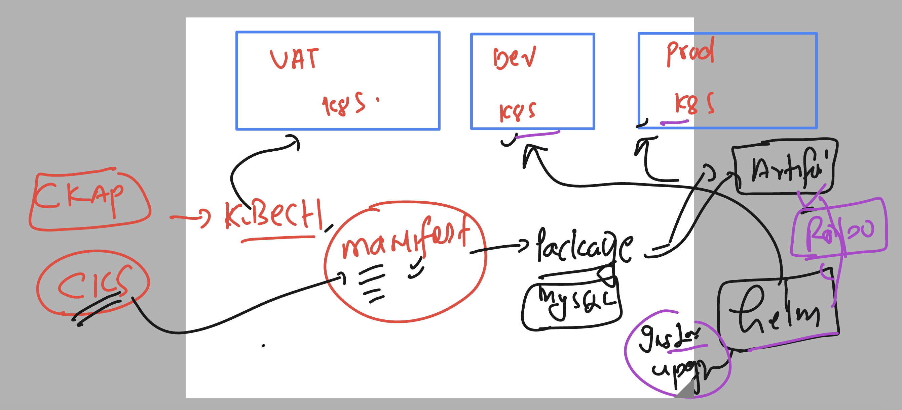

# k8s-cloud4c-b4

## targets


### Extending k8s API's using CRD 


### Helm revision 



### helm phases 


## command helm commands 

### version and listing repo 

```
ashu@ip-172-31-9-111 ashu-apps]$ helm version 
version.BuildInfo{Version:"v3.12.2", GitCommit:"1e210a2c8cc5117d1055bfaa5d40f51bbc2e345e", GitTreeState:"clean", GoVersion:"go1.20.5"}
[ashu@ip-172-31-9-111 ashu-apps]$ 
[ashu@ip-172-31-9-111 ashu-apps]$ helm repo ls
NAME            URL                               
ashu-repo       https://charts.bitnami.com/bitnami
new-repo        https://charts.helm.sh/stable     
[ashu@ip-172-31-9-111 ashu-apps]$ 

```

### these days adding repo is an optional part 

```
[ashu@ip-172-31-9-111 ashu-apps]$ helm repo ls
NAME            URL                               
ashu-repo       https://charts.bitnami.com/bitnami
new-repo        https://charts.helm.sh/stable     
[ashu@ip-172-31-9-111 ashu-apps]$ 
[ashu@ip-172-31-9-111 ashu-apps]$ helm install ashu-app  oci://registry-1.docker.io/bitnamicharts/nginx
Pulled: registry-1.docker.io/bitnamicharts/nginx:15.1.2
Digest: sha256:1482570d46bca932ce08ac2afa438c15393035e77668e4447786ca182910aa58
NAME: ashu-app
LAST DEPLOYED: Thu Aug 10 12:13:24 2023
NAMESPACE: ashu-space
STATUS: deployed
REVISION: 1
TEST SUITE: None

=====>>
[ashu@ip-172-31-9-111 ashu-apps]$ helm ls
NAME            NAMESPACE       REVISION        UPDATED                                 STATUS          CHART           APP VERSION
ashu-app        ashu-space      1

====>>
[ashu@ip-172-31-9-111 ashu-apps]$ kubectl  get deploy
NAME             READY   UP-TO-DATE   AVAILABLE   AGE
ashu-app-nginx   1/1     1            1           66s
[ashu@ip-172-31-9-111 ashu-apps]$ kubectl  get svc
NAME             TYPE           CLUSTER-IP      EXTERNAL-IP   PORT(S)        AGE
ashu-app-nginx   LoadBalancer   10.97.171.203   <pending>     80:31524/TCP   69s
[ashu@ip-172-31-9-111 ashu-apps]$

====>>
[ashu@ip-172-31-9-111 ashu-apps]$ helm uninstall  ashu-app
release "ashu-app" uninstalled

```

## Creating custom helm charts 

### directory for project

```
[ashu@ip-172-31-9-111 ashu-apps]$ mkdir helm-projects
[ashu@ip-172-31-9-111 ashu-apps]$ ls
ashu-k8s-manifest  day15-storage-check  day16-pre-project  day18-things  dbdep.yaml     hpa       labs.txt  python-app
day11-project      day16-mongo-project  day17-testing      day7-app      helm-projects  java-app  node-app  ui-app
[ashu@ip-172-31-9-111 ashu-apps]$ cd helm-projects/
[ashu@ip-172-31-9-111 helm-projects]$ ls
[ashu@ip-172-31-9-111 helm-projects]$ 
[ashu@ip-172-31-9-111 helm-projects]$ helm create  ashu-ui-app
Creating ashu-ui-app
[ashu@ip-172-31-9-111 helm-projects]$ ls
ashu-ui-app
[ashu@ip-172-31-9-111 helm-projects]$ 

```

### see structure 

```
ashu@ip-172-31-9-111 helm-projects]$ ls
ashu-ui-app

[ashu@ip-172-31-9-111 helm-projects]$ ls  ashu-ui-app/
charts  Chart.yaml  templates  values.yaml
[ashu@ip-172-31-9-111 helm-projects]$ 

```

### chart template

```
[ashu@ip-172-31-9-111 helm-projects]$ ls  ashu-ui-app/templates/
deployment.yaml  _helpers.tpl  hpa.yaml  ingress.yaml  NOTES.txt  serviceaccount.yaml  service.yaml  tests
[ashu@ip-172-31-9-111 helm-projects]$ 

```

### importance of values.yaml 


### deploy charts locally 

```
[ashu@ip-172-31-9-111 helm-projects]$ ls
ashu-ui-app
[ashu@ip-172-31-9-111 helm-projects]$ helm install cloud4rc-ui   ./ashu-ui-app/ 
NAME: cloud4rc-ui
LAST DEPLOYED: Thu Aug 10 12:35:32 2023
NAMESPACE: ashu-space
STATUS: deployed
REVISION: 1
TEST SUITE: None
NOTES:
1. Get the application URL by running these commands:
  export NODE_PORT=$(kubectl get --namesp

======>>
[ashu@ip-172-31-9-111 helm-projects]$ helm   ls
NAME            NAMESPACE       REVISION        UPDATED                                 STATUS          CHART                  APP VERSION
cloud4rc-ui     ashu-space      1

===>>
006  helm ls
 1007  ls
 1008  helm upgrade cloud4rc-ui  ./ashu-ui-app/
 1009  helm ls
 1010  kubectl  get  po
 1011  history 
[ashu@ip-172-31-9-111 helm-projects]$ kubectl  get  po
NAME                                       READY   STATUS    RESTARTS   AGE
cloud4rc-ui-ashu-ui-app-584585c764-bjdhw   1/1     Running   0          5m53s
cloud4rc-ui-ashu-ui-app-584585c764-gth6m   1/1     Running   0          12s
[ashu@ip-172-31-9-111 helm-projects]$  
```

