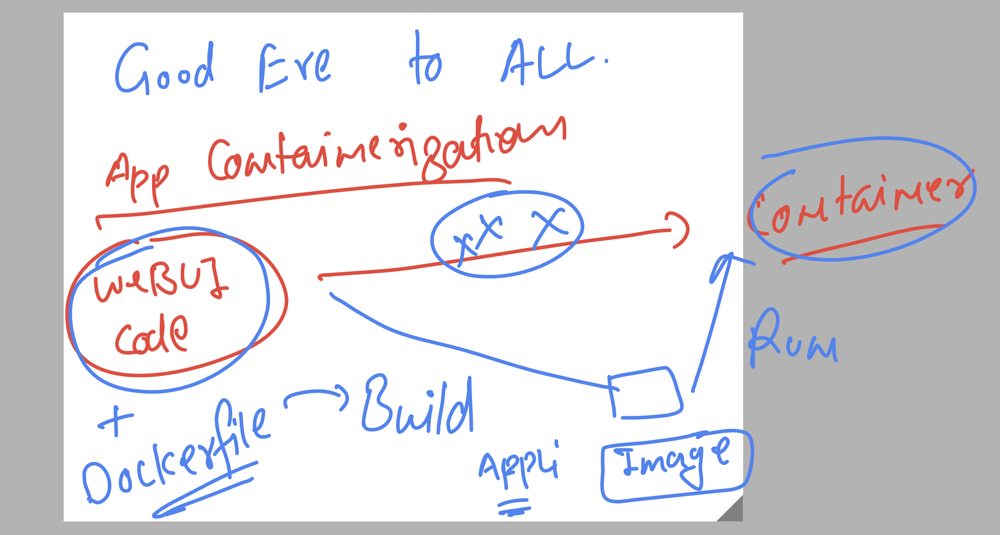
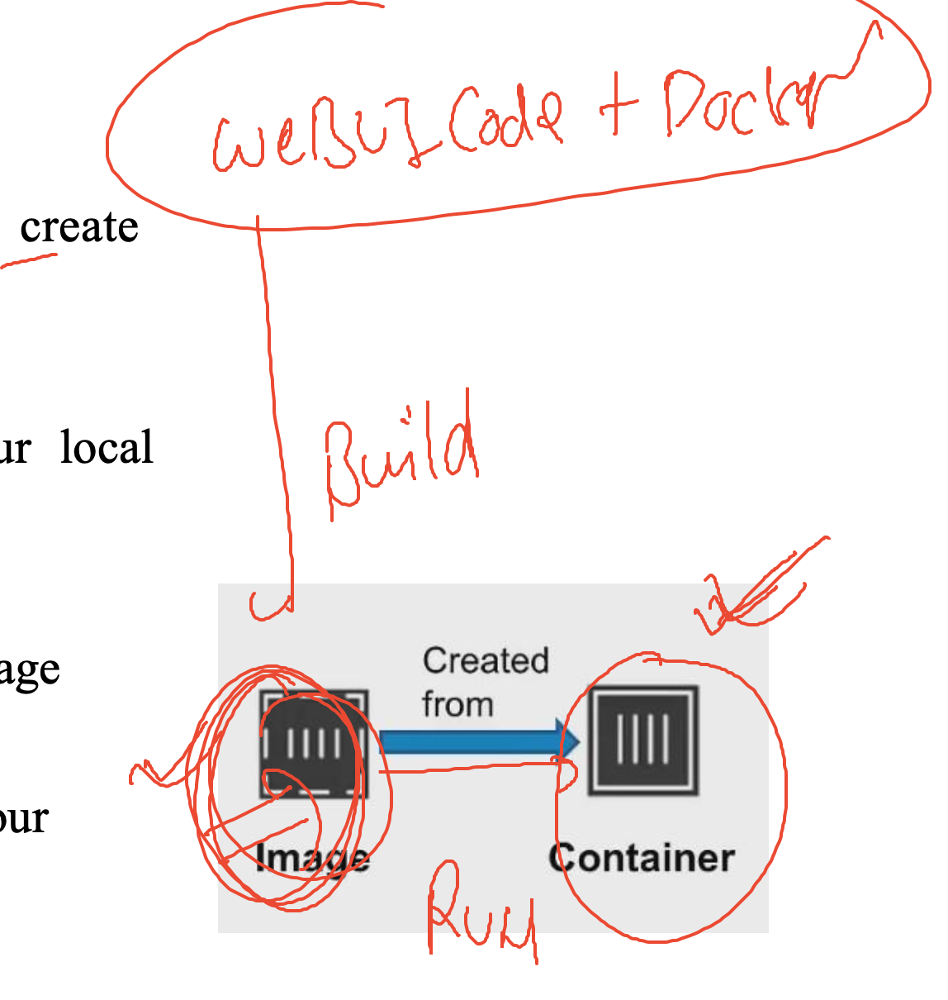

# k8s-cloud4c-b4

## Revision 



## Taking sample web-ui app source code from github 

```
[ashu@ip-172-31-9-111 ashu-apps]$ ls
java-app  node-app  python-app  ui-app
[ashu@ip-172-31-9-111 ashu-apps]$ cd  ui-app/
[ashu@ip-172-31-9-111 ui-app]$ ls
[ashu@ip-172-31-9-111 ui-app]$ git clone https://github.com/schoolofdevops/html-sample-app.git
Cloning into 'html-sample-app'...
remote: Enumerating objects: 74, done.
remote: Counting objects: 100% (74/74), done.
remote: Compressing objects: 100% (69/69), done.
remote: Total 74 (delta 5), reused 72 (delta 5), pack-reused 0
Receiving objects: 100% (74/74), 1.38 MiB | 28.28 MiB/s, done.
Resolving deltas: 100% (5/5), done.
[ashu@ip-172-31-9-111 ui-app]$ ls
html-sample-app
```
## web ui app dockerfile

```
FROM nginx
# this mean we are refering library image from docker hub
LABEL name=ashutoshh
LABEL email=ashutoshh@delvex.io
# optional keyword but you can write info about your self
# just for help purpose 
COPY html-sample-app /usr/share/nginx/html/ 
```

### lets build  webapp to docker image

```
[ashu@ip-172-31-9-111 ui-app]$ ls
Dockerfile  html-sample-app
[ashu@ip-172-31-9-111 ui-app]$ docker  build -t  ashu-uiapp:v1  . 
Sending build context to Docker daemon  3.629MB
Step 1/4 : FROM nginx
 ---> 021283c8eb95
Step 2/4 : LABEL name=ashutoshh
 ---> Running in bf897e1083a7
Removing intermediate container bf897e1083a7
 ---> 5815b9197f2e
Step 3/4 : LABEL email=ashutoshh@delvex.io
 ---> Running in 038adc3bbc52
Removing intermediate container 038adc3bbc52
 ---> 95308857e1f0
Step 4/4 : COPY html-sample-app /usr/share/nginx/html/
 ---> e66083f54983
Successfully built e66083f54983
Successfully tagged ashu-uiapp:v1
```

### verify image 

```
ashu@ip-172-31-9-111 ui-app]$ docker images
REPOSITORY      TAG       IMAGE ID       CREATED          SIZE
karteek-uiapp   v1        1e0ba0352a7a   18 seconds ago   190MB
ashu-uiapp      v1        e66083f54983   23 seconds ago   190MB
mahesh-uiapp    v1        72e0f6337047   25 seconds ago   190MB
nginx           latest    021283c8eb95   13 days ago      187MB
```
## image to container 



### creating container and verify it 

```
[ashu@ip-172-31-9-111 ui-app]$ docker run --name ashuuic1 -d  ashu-uiapp:v1  
bee9715364d045c8440c1a48526463a152cfd431dfc3af815b4245e0724979ab

======> verify list 
[ashu@ip-172-31-9-111 ui-app]$ docker ps
CONTAINER ID   IMAGE              COMMAND                  CREATED         STATUS                  PORTS     NAMES
eb93c408e3b8   karteek-uiapp:v1   "/docker-entrypoint.…"   2 seconds ago   Up Less than a second   80/tcp    karteekuic1
bee9715364d0   ashu-uiapp:v1      "/docker-entrypoint.…"   3 seconds ago   Up 2 seconds            80/tcp    ashuuic1
[ashu@ip-172-31-9-111 ui-app]$ 
```

### Resources consumption by container will same app need

```
 45  docker  stats ashuuic1 
   46  docker  stats 
```

## more container operations 

### stop/kill

```
[ashu@ip-172-31-9-111 ui-app]$ docker  kill ashuuic1
ashuuic1
```

### remove container as well

```
[ashu@ip-172-31-9-111 ui-app]$ docker rm  ashuuic1
ashuuic1
```

## python code to container 

### taking code

```
import time

while True:
    print("Hello all , welcome to python..!!")
    time.sleep(3)
    print("Welcome to Cloud4c..")
    time.sleep(2)
    print("Welcome to Containers ..!!")
    print("______________________")
    time.sleep(3)
```

### Dockerfile

```
FROM python:3.10
LABEL name=ashutoshh
RUN mkdir /mycode 
# we are creating a directory inside new image
COPY ashu.py /mycode/ashu.py 
# copy code to above directory 
CMD ["python","/mycode/ashu.py"]
# CMD will be automatically run code whenever we create container
# from this docker image 


```

## building image

```
[ashu@ip-172-31-9-111 ashu-apps]$ cd python-app/
[ashu@ip-172-31-9-111 python-app]$ ls
ashu.py  Dockerfile
[ashu@ip-172-31-9-111 python-app]$ docker build -t ashupython:v1  . 
Sending build context to Docker daemon  3.072kB
Step 1/5 : FROM python:3.10
 ---> d9122363988f
Step 2/5 : LABEL name=ashutoshh
 ---> Running in 8ff9dcd0daf1
Removing intermediate container 8ff9dcd0daf1
 ---> f0a4a6622cbb
Step 3/5 : RUN mkdir /mycode
 ---> Running in fccde95cf2bd
Removing intermediate container fccde95cf2bd
 ---> 28056f25adb5
Step 4/5 : COPY ashu.py /mycode/ashu.py
 ---> 1b78f7f8ec16
Step 5/5 : CMD ["python","/mycode/ashu.py"]
 ---> Running in 8b31765a32d2
Removing intermediate container 8b31765a32d2
 ---> a5e4ed77cbd0
Successfully built a5e4ed77cbd0
Successfully tagged ashupython:v1
```

### verify 

```
ashu@ip-172-31-9-111 python-app]$ docker images
REPOSITORY            TAG       IMAGE ID       CREATED              SIZE
venkatpythonapp       v1        0a6e176babad   6 seconds ago        1.01GB
rajeswari-pythonapp   v1        db030127c02a   18 seconds ago       1GB
ashupython            v1        a5e4ed77cbd0   51 seconds ago       1GB
mogal-pythonapp       v1        0c5d6339aadc   About a minute ago   1GB
karteekpythonc1       v1        695ec50f0a92   About a minute ago   1GB
mahesh-pythonapp      latest    cd09561a6d40   2 minutes ago        1GB
````

### creating container

```
[ashu@ip-172-31-9-111 python-app]$ docker run --name ashupyc1 -d -it  ashupython:v1  
1c46d44a7403209cff78ece03e259e6295af563cf5184dcff14efffaac53278f
[ashu@ip-172-31-9-111 python-app]$ docker ps
CONTAINER ID   IMAGE                  COMMAND                  CREATED              STATUS              PORTS     NAMES
1c46d44a7403   ashupython:v1          "python /mycode/ashu…"   4 seconds ago        Up 2 seconds                  ashupyc1
d7de5eadd259   mogal-pythonapp:v1     "python /mycode/moga…"   11 seconds ago       Up 10 seconds                 mogalc1
1e2eea2e5710   haritha-pythonapp:v1   "python /mycode/conf…"   About a minute ago   Up About a minute             harithapythonc1
652e39ccf58f   cd0                    "python /mycode/mahe…"   About a minute ago   Up About a minute             mahesh-pythonapp
```

### checking output 

```
[ashu@ip-172-31-9-111 python-app]$ docker logs  ashupyc1
Hello all , welcome to python..!!
Welcome to Cloud4c..
Welcome to Containers ..!!
______________________
Hello all , welcome to python..!!
Welcome to Cloud4c..
Welcome to Containers ..!!
______________________
```
