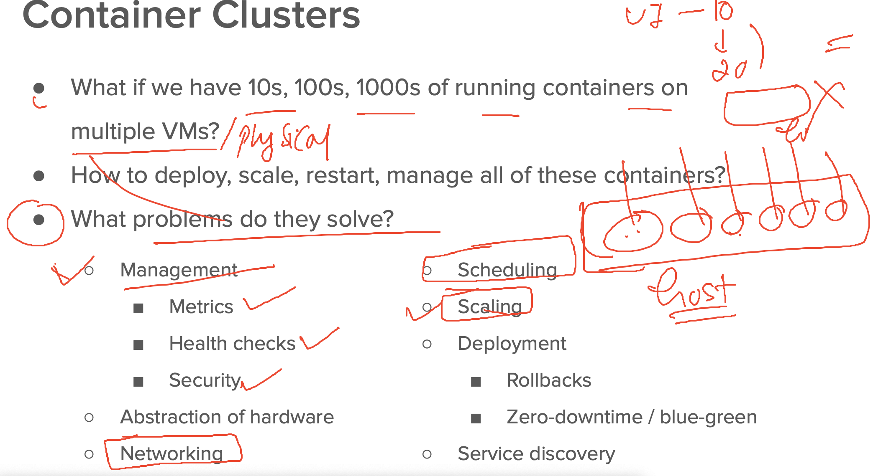
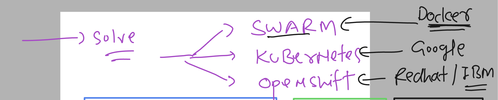
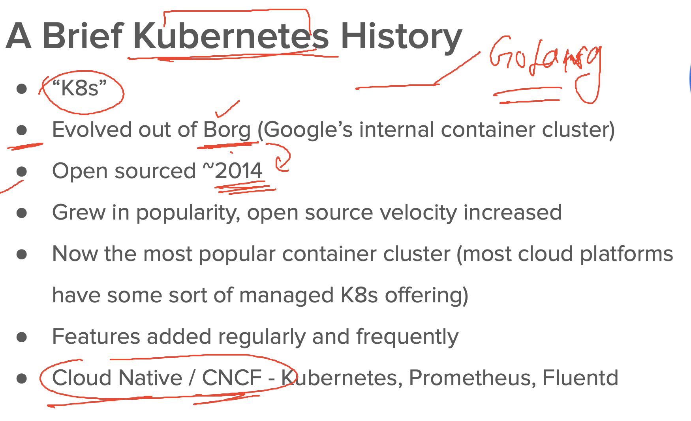
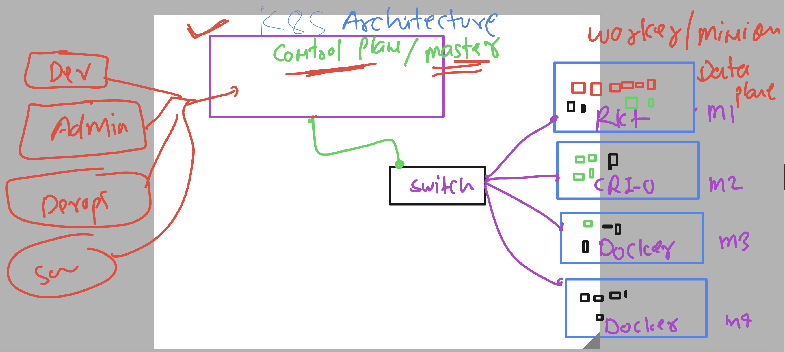
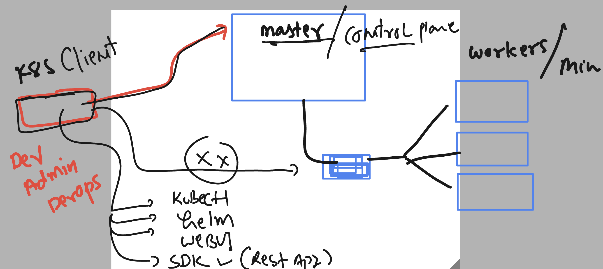
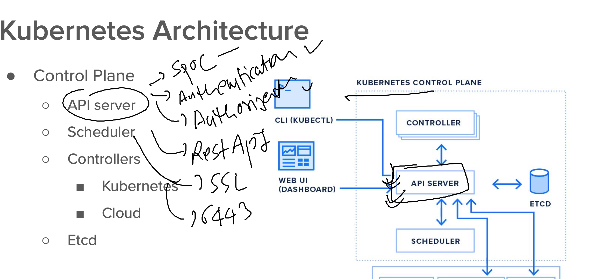

# k8s-cloud4c-b4

### containering node app

### dockerfile + code of node

```
[ashu@ip-172-31-9-111 ashu-apps]$ ls
java-app  node-app  python-app  ui-app
[ashu@ip-172-31-9-111 ashu-apps]$ cd  node-app/
[ashu@ip-172-31-9-111 node-app]$ ls
[ashu@ip-172-31-9-111 node-app]$ ls
Dockerfile
[ashu@ip-172-31-9-111 node-app]$ git clone https://github.com/redashu/node-demo-app-spinnaker.git
Cloning into 'node-demo-app-spinnaker'...
remote: Enumerating objects: 71, done.
remote: Counting objects: 100% (2/2), done.
remote: Compressing objects: 100% (2/2), done.
remote: Total 71 (delta 0), reused 0 (delta 0), pack-reused 69
Receiving objects: 100% (71/71), 15.73 KiB | 3.15 MiB/s, done.
Resolving deltas: 100% (29/29), done.
[ashu@ip-172-31-9-111 node-app]$ ls
Dockerfile  node-demo-app-spinnaker
```

### Dockerfile content 

```
FROm node
LABEL email=ashutoshh@linux.com
RUN mkdir /myapp 
COPY node-demo-app-spinnaker /myapp/
WORKDIR /myapp
# to change directory like cd in linux / unix 
RUN npm install 
CMD ["npm","start"]
# cmd is only gonna call when we create container 

```

### .dockerignore 

```
node-demo-app-spinnaker/README.md
node-demo-app-spinnaker/.git

```

### building image

```
[ashu@ip-172-31-9-111 node-app]$ ls
Dockerfile  node-demo-app-spinnaker
[ashu@ip-172-31-9-111 node-app]$ docker build -t ashunode:appv1 . 
Sending build context to Docker daemon  32.77kB
Step 1/7 : FROm node
latest: Pulling from library/node
d52e4f012db1: Already exists 
7dd206bea61f: Already exists 
2320f9be4a9c: Already exists 
6e5565e0ba8d: Already exists 
5f1526a28cf9: Pull complete 
b9c7405b482f: Pull complete 
9db0bc99587b: Pull complete 
8e1c8c1907a5: Pull complete 
Digest: sha256:b3ca7d32f0c12291df6e45a914d4ee60011a3fce4a978df5e609e356a4a2cb88
Status: Downloaded newer image for node:latest
 ---> b098c9ebef91
Step 2/7 : LABEL email=ashutoshh@linux.com
 ---> Running in 2a19c0584c03
Removing intermediate container 2a19c0584c03
 ---> fc65cf56ef29
Step 3/7 : RUN mkdir /myapp
 ---> Running in 171c7817f5df
Removing intermediate container 171c7817f5df
 ---> 40a03246f77b
Step 4/7 : COPY node-demo-app-spinnaker /myapp/
 ---> b5bc92aba35d
Step 5/7 : WORKDIR /myapp
 ---> Running in 3a36b0479b75
Removing intermediate container 3a36b0479b75
 ---> 0d36e3dc61b3
Step 6/7 : RUN npm install
 ---> Running in e703f4a4dcce
npm WARN old lockfile 
npm WARN old lockfile The package-lock.json file was created with an old version of npm,
npm WARN old lockfile so supplemental metadata must be fetched from the registry.
npm WARN old lockfile 
npm WARN old lockfile This is a one-time fix-up, please be patient...
npm WARN old lockfile 

added 49 packages, and audited 50 packages in 1s

3 high severity vulnerabilities

To address all issues, run:
  npm audit fix

Run `npm audit` for details.
npm notice 
npm notice New minor version of npm available! 9.7.2 -> 9.8.0
npm notice Changelog: <https://github.com/npm/cli/releases/tag/v9.8.0>
npm notice Run `npm install -g npm@9.8.0` to update!
npm notice 
Removing intermediate container e703f4a4dcce
 ---> 73eb71e25ec2
Step 7/7 : CMD ["npm","start"]
 ---> Running in 7b9880e1aa4b
Removing intermediate container 7b9880e1aa4b
 ---> ce00f146e406
Successfully built ce00f146e406
Successfully tagged ashunode:appv1
```

### verify image build

```
[ashu@ip-172-31-9-111 node-app]$ docker images
REPOSITORY                               TAG          IMAGE ID       CREATED          SIZE
venkatnodeapp                            latest       f1e53095615a   13 seconds ago   1.1GB
rajinode                                 v1           ae594947cd70   23 seconds ago   1.1GB
maheshnode                               V1           5a1443a36954   39 seconds ago   1.1GB
ashunode                                 appv1        ce00f146e406   45 seconds ago   1.1GB
```

### having another dockerfile 

```
[ashu@ip-172-31-9-111 node-app]$ ls
Dockerfile  node-demo-app-spinnaker  small.dockerfile
[ashu@ip-172-31-9-111 node-app]$ docker build -t ashunodejs:v1 -f small.dockerfile  . 
Sending build context to Docker daemon  33.79kB
Step 1/7 : FROm node:alpine
alpine: Pulling from library/node
31e352740f53: Already exists 
c0eace37d671: Pull complete 
c3ba46e7ba31: Pull complete 
72595614f727: Pull complete 
Digest: sha256:1c411f88868d97e206a5fdb78cbcee49add59022ecf1f52d54f15e1d4518c5c2
Status: Downloaded newer image for node:alpine
 ---> 49ee0e374837
Step 2/7 : LABEL email=ashutoshh@linux.com
 ---> Running in ab680a20a0b9
Removing intermediate container ab680a20a0b9
 ---> 6fde1dc9a7dc
Step 3/7 : RUN mkdir /myapp
 ---> Running in 5b9e2f3df4ec
Removing intermediate container 5b9e2f3df4ec
 ---> 38874f4f2c36
Step 4/7 : COPY node-demo-app-spinnaker /myapp/
 ---> adf9aa391d5b
Step 5/7 : WORKDIR /myapp
 ---> Running in fe210e0324be
Removing intermediate container fe210e0324be
 ---> 36fa24e78a21
Step 6/7 : RUN npm install
 ---> Running in 889646412e65
npm WARN old lockfile 
npm WARN old lockfile The package-lock.json file was created with an old version of npm,
npm WARN old lockfile so supplemental metadata must be fetched from the registry.
npm WARN old lockfile 
npm WARN old lockfile This is a one-time fix-up, please be patient...
npm WARN old lockfile 

added 49 packages, and audited 50 packages in 2s

3 high severity vulnerabilities

To address all issues, run:
  npm audit fix

Run `npm audit` for details.
npm notice 
npm notice New minor version of npm available! 9.7.2 -> 9.8.0
npm notice Changelog: <https://github.com/npm/cli/releases/tag/v9.8.0>
npm notice Run `npm install -g npm@9.8.0` to update!
npm notice 
Removing intermediate container 889646412e65
 ---> c486b5344028
Step 7/7 : CMD ["npm","start"]
 ---> Running in 6f7ff99e6a48
Removing intermediate container 6f7ff99e6a48
 ---> 2a5d82047f86
Successfully built 2a5d82047f86
Successfully tagged ashunodejs:v1
[ashu@ip-172-31-9-111 node-app]$ 
```

### small.dockerfile

```
FROm node:alpine
LABEL email=ashutoshh@linux.com
RUN mkdir /myapp 
COPY node-demo-app-spinnaker /myapp/
WORKDIR /myapp
# to change directory like cd in linux / unix 
RUN npm install 
CMD ["npm","start"]
# cmd is only gonna call when we create container 

```

### problem with multihost container env



### solution introduction 



### kubernetes introduction 




## Understanding k8s architecture 

### level 1 



### k8s client side software -- 



## info about first k8s master node componet

### APi-server




