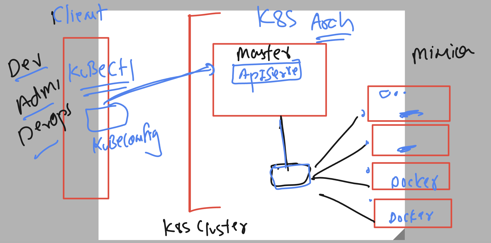
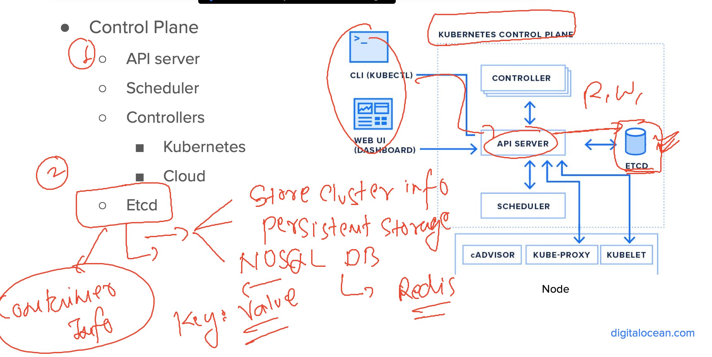
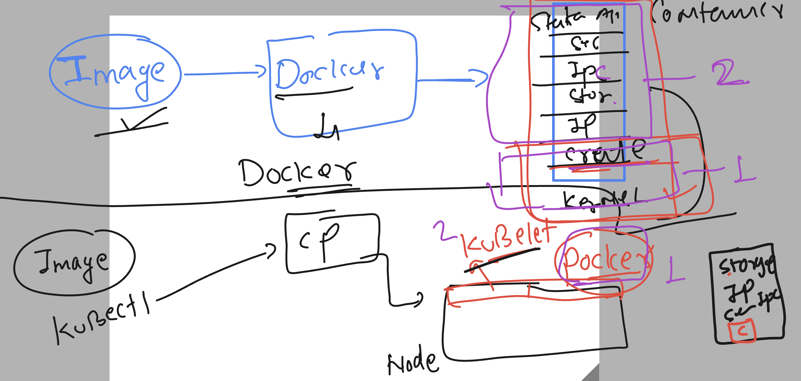
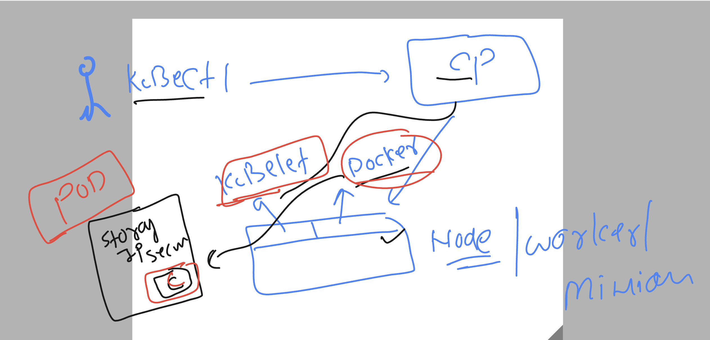
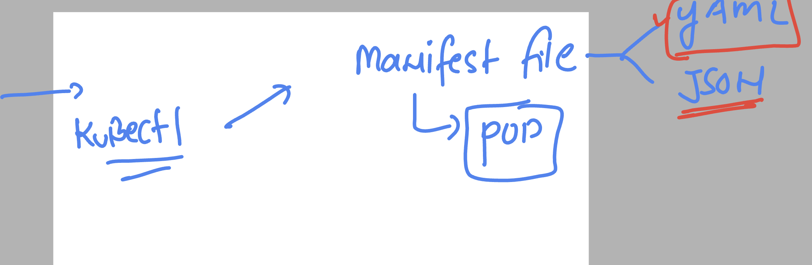

# k8s-cloud4c-b4

## Revision 



### verify kubectl connection from client to k8s master

```
[ashu@ip-172-31-9-111 ashu-apps]$ kubectl  get nodes
NAME         STATUS   ROLES           AGE   VERSION
masternode   Ready    control-plane   27h   v1.27.3
node1        Ready    <none>          27h   v1.27.3
node2        Ready    <none>          27h   v1.27.3
node3        Ready    <none>          27h   v1.27.3
[ashu@ip-172-31-9-111 ashu-apps]$ kubectl  cluster-info 
Kubernetes control plane is running at https://13.200.76.193:6443
CoreDNS is running at https://13.200.76.193:6443/api/v1/namespaces/kube-system/services/kube-dns:dns/proxy

To further debug and diagnose cluster problems, use 'kubectl cluster-info dump'.
[ashu@ip-172-31-9-111 ashu-apps]$ 


```

## Introduction to second most import master node component



## lets push last day image of node app to docker hub 

```
[ashu@ip-172-31-9-111 ashu-apps]$ docker images  | grep ashu
ashunodejs                               v1           2a5d82047f86   24 hours ago   186MB
ashunode                                 appv1        ce00f146e406   24 hours ago   1.1GB
ashualp                                  pycodev1     04935507879e   47 hours ago   50.7MB
ashupython                               v1           a5e4ed77cbd0   2 days ago     1GB
dockerashu/ashu-app                      v1           89f0a2c36f4b   2 days ago     190MB
ashu-uiapp                               v1           89f0a2c36f4b   2 days ago     190MB
[ashu@ip-172-31-9-111 ashu-apps]$ 
[ashu@ip-172-31-9-111 ashu-apps]$ docker tag  ashunode:appv1   docker.io/dockerashu/nodeapp:v1 
[ashu@ip-172-31-9-111 ashu-apps]$ docker login 
Authenticating with existing credentials...
WARNING! Your password will be stored unencrypted in /home/ashu/.docker/config.json.
Configure a credential helper to remove this warning. See
https://docs.docker.com/engine/reference/commandline/login/#credentials-store

Login Succeeded
[ashu@ip-172-31-9-111 ashu-apps]$ docker push docker.io/dockerashu/nodeapp:v1 
The push refers to repository [docker.io/dockerashu/nodeapp]
bc305fc3c296: Pushed 
53b54bda291d: Pushed 
0e3cb208d303: Pushed 
89e26aac0240: Mounted from library/node 
```

### understanding role or kubelet and docker in minion node 



### Introduction to pod 



### creating pod using manifest file 



### creating a directory to put manifest

```
[ashu@ip-172-31-9-111 ashu-apps]$ ls
java-app  node-app  python-app  ui-app
[ashu@ip-172-31-9-111 ashu-apps]$ mkdir  ashu-k8s-manifest
[ashu@ip-172-31-9-111 ashu-apps]$ ls
ashu-k8s-manifest  java-app  node-app  python-app  ui-app
[ashu@ip-172-31-9-111 ashu-apps]$ ls  ashu-k8s-manifest/
ashu-nodeapp-pod1.yaml
[ashu@ip-172-31-9-111 ashu-apps]$ 

```

### first pod manifest 

```
apiVersion: v1 # we are targing api server version 1 
kind: Pod # we are asking k8s master to take req about pod
metadata: # info about Kind value
  name: ashu-nodeapp-pod1 # name of my pod 
spec: # everything we need in pod 
  containers: 
  - name: ashuc1
    image: docker.io/dockerashu/nodeapp:v1 
```

### lets deploy it 

```
[ashu@ip-172-31-9-111 ashu-apps]$ ls
ashu-k8s-manifest  java-app  node-app  python-app  ui-app
[ashu@ip-172-31-9-111 ashu-apps]$ cd  ashu-k8s-manifest/
[ashu@ip-172-31-9-111 ashu-k8s-manifest]$ ls
ashu-nodeapp-pod1.yaml
[ashu@ip-172-31-9-111 ashu-k8s-manifest]$ kubectl   create  -f  ashu-nodeapp-pod1.yaml 
pod/ashu-nodeapp-pod1 created
[ashu@ip-172-31-9-111 ashu-k8s-manifest]$ kubectl   get  pods
NAME                  READY   STATUS    RESTARTS   AGE
ashu-nodeapp-pod1     1/1     Running   0          18s
harithanodeapp-pod1   1/1     Running   0          14s
mogal-nodeapp-pod1    1/1     Running   0          14s
[ashu@ip-172-31-9-111 ashu-k8s-manifest]$ 

```


