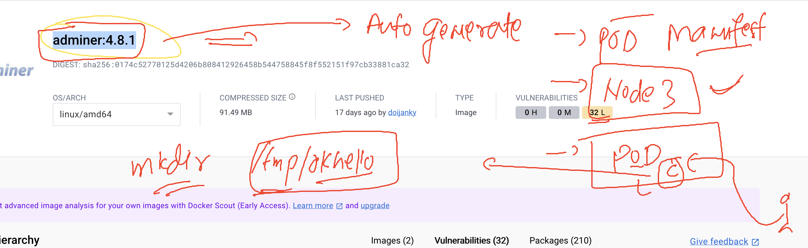

# k8s-cloud4c-b4

### Revision 


## problems 

### -- auto generate manifest 
### -- pod level isolation 

### generating / printing yaml / json based pod manifest 

```
 183  kubectl   run  ashupod1  --image=docker.io/dockerashu/nodeapp:v1  --port 3000 --dry-run=client -o  yaml 
  184  kubectl   run  ashupod1  --image=docker.io/dockerashu/nodeapp:v1  --port 3000 --dry-run=client -o  json 
```

### storing pod manifest into files

```
[ashu@ip-172-31-9-111 ashu-k8s-manifest]$ kubectl   run  ashupod1  --image=docker.io/dockerashu/nodeapp:v1  --port 3000 --dry-run=client -o  yaml >auto.yaml
[ashu@ip-172-31-9-111 ashu-k8s-manifest]$ ls
ashu-nodeapp-pod1.yaml  auto.yaml
[ashu@ip-172-31-9-111 ashu-k8s-manifest]$ kubectl   run  ashupod1  --image=docker.io/dockerashu/nodeapp:v1  --port 3000 --dry-run=client -o json >hello.json
[ashu@ip-172-31-9-111 ashu-k8s-manifest]$ ls
ashu-nodeapp-pod1.yaml  auto.yaml  hello.json
[ashu@ip-172-31-9-111 ashu-k8s-manifest]$ 

```

### creating manifest request

```
[ashu@ip-172-31-9-111 ashu-k8s-manifest]$ kubectl  create -f  auto.yaml 
pod/ashupod1 created
[ashu@ip-172-31-9-111 ashu-k8s-manifest]$ kubectl  get  pods
NAME                READY   STATUS    RESTARTS   AGE
ashupod1            1/1     Running   0          3s
```

### replace and delete with manifest 

```
ashu@ip-172-31-9-111 ashu-k8s-manifest]$ kubectl  delete -f auto.yaml 
pod "ashupod1" deleted

kubectl  replace -f auto.yaml --force

```

### same command with json based manifest as well

```
ashu@ip-172-31-9-111 ashu-k8s-manifest]$ ls
ashu-nodeapp-pod1.yaml  auto.yaml  hello.json
[ashu@ip-172-31-9-111 ashu-k8s-manifest]$ kubectl  create -f hello.json 
pod/ashupod1 created
[ashu@ip-172-31-9-111 ashu-k8s-manifest]$ kubectl  delete -f hello.json 
pod "ashupod1" deleted

```


### task 1



### solution 

```
apiVersion: v1
kind: Pod
metadata:
  creationTimestamp: null
  labels:
    run: ashupod-task1
  name: ashupod-task1
spec:
  nodeName: node3  # static scheduling of pod 
  containers:
  - image: adminer:4.8.1
    name: ashupod-task1
    ports:
    - containerPort: 8080
    resources: {}
  dnsPolicy: ClusterFirst
  restartPolicy: Always
status: {}

```

### checking 

```
ashu@ip-172-31-9-111 ashu-k8s-manifest]$ kubectl  replace -f task1.yaml  --force 
pod "ashupod-task1" deleted
pod/ashupod-task1 replaced
[ashu@ip-172-31-9-111 ashu-k8s-manifest]$ kubectl  get po -o wide
NAME                READY   STATUS              RESTARTS   AGE     IP                NODE     NOMINATED NODE   READINESS GATES
ashupod-task1       0/1     ContainerCreating   0          5s      <none>            node3    <none>           <none>
hari-nodeapp-pod1   1/1     Running             0          8m32s   192.168.166.178   node1    <none>           <none>
karteekpod-adm1     0/1     
```

### accessing container inside pod from kubectl 

```
[ashu@ip-172-31-9-111 ashu-k8s-manifest]$ kubectl   exec -it  ashupod-task1  -- bash 
adminer@ashupod-task1:/var/www/html$ 
adminer@ashupod-task1:/var/www/html$ mkdir  /tmp/okhello
adminer@ashupod-task1:/var/www/html$ ls /tmp/
okhello
adminer@ashupod-task1:/var/www/html$ exit
exit
```


