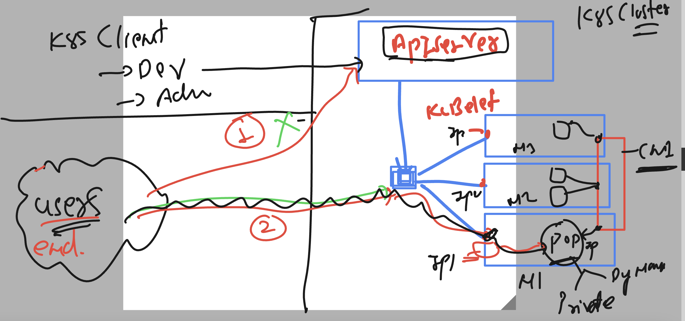
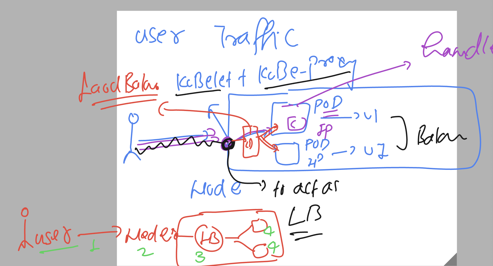
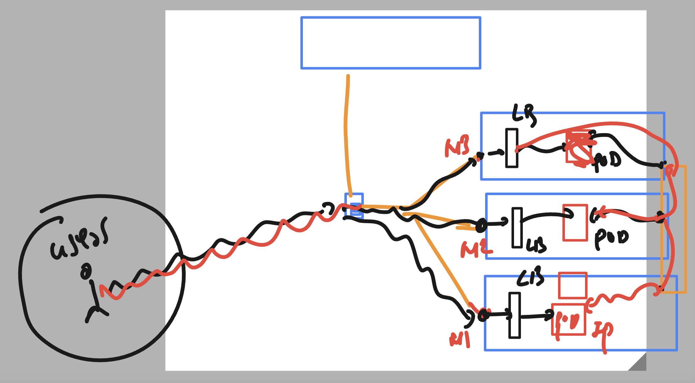
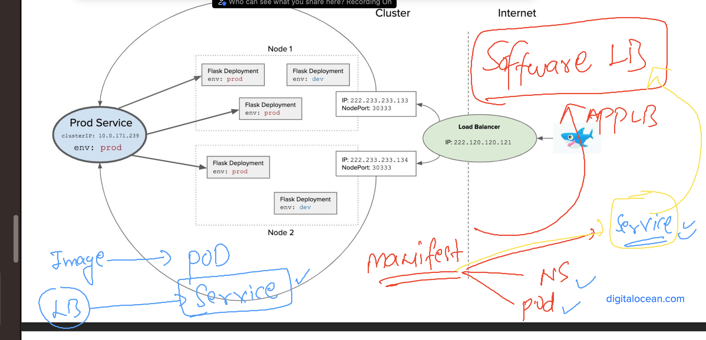
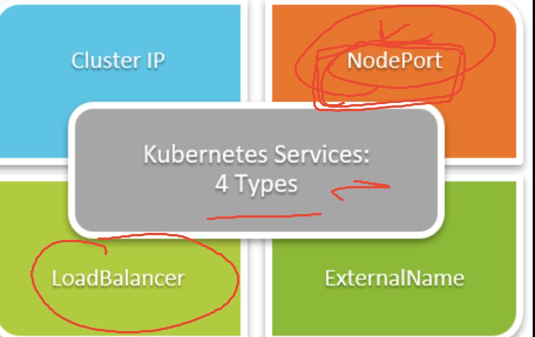
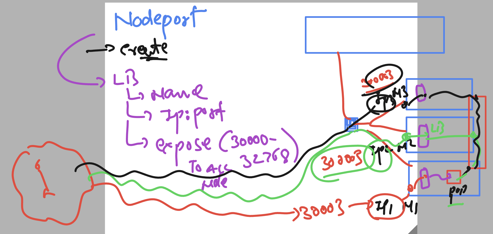
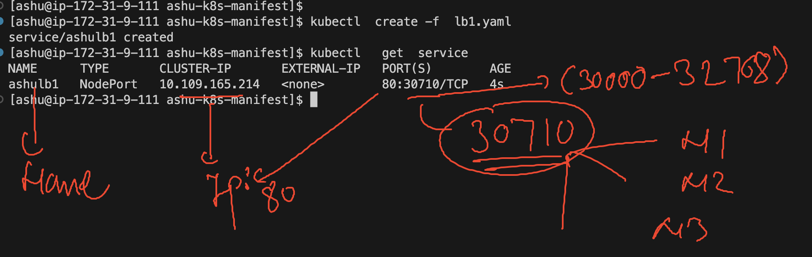

# k8s-cloud4c-b4

### connecting and checking lab access

```
[ashu@ip-172-31-9-111 ashu-apps]$ kubectl  get nodes
NAME         STATUS   ROLES           AGE    VERSION
masternode   Ready    control-plane   5d3h   v1.27.3
node1        Ready    <none>          5d3h   v1.27.3
node2        Ready    <none>          5d3h   v1.27.3
node3        Ready    <none>          5d3h   v1.27.3
[ashu@ip-172-31-9-111 ashu-apps]$ kubectl config get-contexts
CURRENT   NAME                          CLUSTER      AUTHINFO           NAMESPACE
*         kubernetes-admin@kubernetes   kubernetes   kubernetes-admin   ashu-space
[ashu@ip-172-31-9-111 ashu-apps]$ 

```

### Pod-Pod communication is by default allowed --- Testing 

```
kubectl  run ashu-app --image=dockerashu/ashuweb-ui:app4 --port 80 --dry-run=client -o yaml >apptest.yaml 
```

### creating pod

```
[ashu@ip-172-31-9-111 ashu-k8s-manifest]$ ls
apptest.yaml  ashu-nodeapp-pod1.yaml  auto.yaml  hello.json  ns.yaml  task1.yaml  ui.yaml
[ashu@ip-172-31-9-111 ashu-k8s-manifest]$ kubectl  create -f  apptest.yaml 
pod/ashu-app created
[ashu@ip-172-31-9-111 ashu-k8s-manifest]$ kubectl  get pod
NAME       READY   STATUS    RESTARTS   AGE
ashu-app   1/1     Running   0          5s
[ashu@ip-172-31-9-111 ashu-k8s-manifest]$ kubectl  get pod -o wide
NAME       READY   STATUS    RESTARTS   AGE   IP                NODE    NOMINATED NODE   READINESS GATES
ashu-app   1/1     Running   0          8s    192.168.166.139   node1   <none>           <none>
[ashu@ip-172-31-9-111 ashu-k8s-manifest]$ 

```

###  testing pod to pod access using http request

```
[ashu@ip-172-31-9-111 ashu-k8s-manifest]$ kubectl   get  pods
NAME       READY   STATUS    RESTARTS   AGE
ashu-app   1/1     Running   0          4m46s
[ashu@ip-172-31-9-111 ashu-k8s-manifest]$ kubectl   exec -it  ashu-app -- bash 
root@ashu-app:/# 
root@ashu-app:/# 
root@ashu-app:/# curl http://192.168.135.24/health.html 
<h1> this is sample page for health check purpose of web app by ashutoshh  </h1>
<h2> adding more health page data  new </h2>
<h3> ashutoshh adding a new change 1st now 2nd  okk change 3  </h3>
root@ashu-app:/# 

```

### general user traffice to access app -- user-->nodes-->pods



### a step more closure to node traffic to lb 



### loadbalancer by k8s internal will be created in every node by default



## Introduction to service resource in k8s -- to create Software based Internal LB --



### type of service in k8s 



### working of Nodeport service 



### creating manifest to create nodeport service --

```
[ashu@ip-172-31-9-111 ashu-k8s-manifest]$ kubectl   get  pods
NAME       READY   STATUS    RESTARTS   AGE
ashu-app   1/1     Running   0          54m
[ashu@ip-172-31-9-111 ashu-k8s-manifest]$ kubectl   get  pods -o wide
NAME       READY   STATUS    RESTARTS   AGE   IP                NODE    NOMINATED NODE   READINESS GATES
ashu-app   1/1     Running   0          55m   192.168.166.139   node1   <none>           <none>
[ashu@ip-172-31-9-111 ashu-k8s-manifest]$ ls
apptest.yaml  ashu-nodeapp-pod1.yaml  auto.yaml  hello.json  ns.yaml  task1.yaml  ui.yaml
[ashu@ip-172-31-9-111 ashu-k8s-manifest]$ 
[ashu@ip-172-31-9-111 ashu-k8s-manifest]$ 
[ashu@ip-172-31-9-111 ashu-k8s-manifest]$ kubectl   expose  pod ashu-app  --type NodePort --port 80 --name ashulb1 --dry-run=client -o yaml >lb1.yaml 
[ashu@ip-172-31-9-111 ashu-k8s-manifest]$ 

```

### yaml of service 

```
apiVersion: v1
kind: Service
metadata:
  creationTimestamp: null
  labels:
    run: ashu-app
  name: ashulb1 # name of Loadbalancer 
spec:
  ports:
  - port: 80
    protocol: TCP
    targetPort: 80
  selector:
    run: ashu-app
  type: NodePort # type of service 
status:
  loadBalancer: {}

```

### create it

```
[ashu@ip-172-31-9-111 ashu-k8s-manifest]$ kubectl  create -f  lb1.yaml 
service/ashulb1 created
[ashu@ip-172-31-9-111 ashu-k8s-manifest]$ kubectl   get  service
NAME      TYPE       CLUSTER-IP       EXTERNAL-IP   PORT(S)        AGE
ashulb1   NodePort   10.109.165.214   <none>        80:30710/TCP   4s
[ashu@ip-172-31-9-111 ashu-k8s-manifest]$ 


```


### visual 



