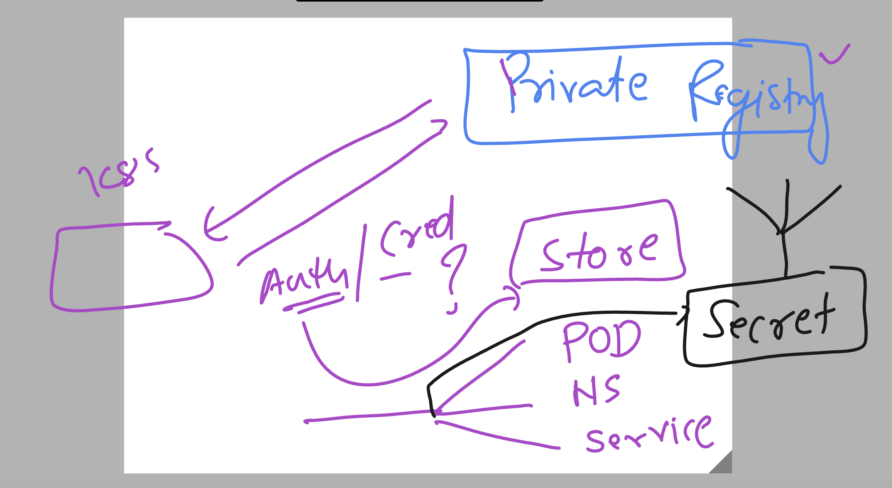

# k8s-cloud4c-b4

### containerizing webui app to docker image

### source code 

```
[ashu@ip-172-31-9-111 ashu-apps]$ mkdir  day7-app
[ashu@ip-172-31-9-111 ashu-apps]$ cd day7-app/


[ashu@ip-172-31-9-111 day7-app]$ git clone https://github.com/microsoft/project-html-website.git
Cloning into 'project-html-website'...
remote: Enumerating objects: 24, done.
remote: Counting objects: 100% (5/5), done.
remote: Compressing objects: 100% (5/5), done.
remote: Total 24 (delta 0), reused 4 (delta 0), pack-reused 19
Receiving objects: 100% (24/24), 465.86 KiB | 1.78 MiB/s, done.


[ashu@ip-172-31-9-111 day7-app]$ ls
project-html-website
[ashu@ip-172-31-9-111 day7-app]$ 

```

### Adding Dockerfile

```
FROM nginx
LABEL name=ashutoshh
COPY  project-html-website /usr/share/nginx/html/   
```

### .dockerignore 

```
project-html-website/.git
project-html-website/LICENSE
project-html-website/*.md 
```

## build docker image 

```
ashu@ip-172-31-9-111 day7-app]$ ls
Dockerfile  project-html-website
[ashu@ip-172-31-9-111 day7-app]$ docker  build  -t  docker.io/dockerashu/day7ui:appv1  . 
Sending build context to Docker daemon    834kB
Step 1/3 : FROM nginx
 ---> 021283c8eb95
Step 2/3 : LABEL name=ashutoshh
 ---> Using cache
 ---> 5815b9197f2e
Step 3/3 : COPY  project-html-website /usr/share/nginx/html/
 ---> 2fdf8ae3e64f
Successfully built 2fdf8ae3e64f
Successfully tagged dockerashu/day7ui:appv1
```

### pushing image to docker hub 

```
hu@ip-172-31-9-111 day7-app]$ 
[ashu@ip-172-31-9-111 day7-app]$ docker login 
Authenticating with existing credentials...
WARNING! Your password will be stored unencrypted in /home/ashu/.docker/config.json.
Configure a credential helper to remove this warning. See
https://docs.docker.com/engine/reference/commandline/login/#credentials-store

Login Succeeded
[ashu@ip-172-31-9-111 day7-app]$ docker push  docker.io/dockerashu/day7ui:appv1 
The push refers to repository [docker.io/dockerashu/day7ui]
7654c17d325e: Pushing [==>                                                ]  40.96kB/822.2kB
3c9d04c9ebd5: Preparing 
434c6a715c30: Preparing 
9fdfd12bc85b: Preparing 
```

### using above docker hub image lets create pod manifest

```
[ashu@ip-172-31-9-111 ashu-k8s-manifest]$ ls
apptest.yaml  ashu-nodeapp-pod1.yaml  auto.yaml  hello.json  lb1.yaml  ns.yaml  task1.yaml  ui.yaml
[ashu@ip-172-31-9-111 ashu-k8s-manifest]$ kubectl  run  ashu-day7pod --image=docker.io/dockerashu/day7ui:appv1 --port 80 --dry-run=client -o yaml >day7pod.yaml

[ashu@ip-172-31-9-111 ashu-k8s-manifest]$ kubectl  create -f day7pod.yaml 
pod/ashu-day7pod created

[ashu@ip-172-31-9-111 ashu-k8s-manifest]$ kubectl  get  pods
NAME           READY   STATUS              RESTARTS   AGE
ashu-day7pod   0/1     ContainerCreating   0          2s
[ashu@ip-172-31-9-111 ashu-k8s-manifest]$ 

```

### creating service (Loadbalancer)

```
[ashu@ip-172-31-9-111 ashu-k8s-manifest]$ kubectl   get  pods
NAME           READY   STATUS    RESTARTS   AGE
ashu-day7pod   1/1     Running   0          5m44s
[ashu@ip-172-31-9-111 ashu-k8s-manifest]$ kubectl   expose pod  ashu-day7pod  --type NodePort --port 80 --name ashulb1 --dry-run=client -o yaml >nplb.yaml

[ashu@ip-172-31-9-111 ashu-k8s-manifest]$ 
[ashu@ip-172-31-9-111 ashu-k8s-manifest]$ kubectl  create -f nplb.yaml 
service/ashulb1 created

[ashu@ip-172-31-9-111 ashu-k8s-manifest]$ kubectl  get  svc
NAME      TYPE       CLUSTER-IP     EXTERNAL-IP   PORT(S)        AGE
ashulb1   NodePort   10.98.32.108   <none>        80:32453/TCP   2s
[ashu@ip-172-31-9-111 ashu-k8s-manifest]$ 

```

### creating loadbalancer service

```
[ashu@ip-172-31-9-111 ashu-k8s-manifest]$ kubectl   expose pod  ashu-day7pod  --type LoadBalancer --port 80 --name ashulb2 --dry-run=client -o yaml >lb.y
aml
[ashu@ip-172-31-9-111 ashu-k8s-manifest]$ kubectl  create -f lb.yaml 
service/ashulb2 created
[ashu@ip-172-31-9-111 ashu-k8s-manifest]$ kubectl  get svc
NAME      TYPE           CLUSTER-IP       EXTERNAL-IP   PORT(S)        AGE
ashulb1   NodePort       10.98.32.108     <none>        80:32453/TCP   5m41s
ashulb2   LoadBalancer   10.110.170.159   <pending>     80:30566/TCP   3s
[ashu@ip-172-31-9-111 ashu-k8s-manifest]$ 

```

### deleting pod and svc from personal namespace

```
[ashu@ip-172-31-9-111 ashu-k8s-manifest]$ kubectl  get pod
NAME           READY   STATUS    RESTARTS   AGE
ashu-day7pod   1/1     Running   0          20m
[ashu@ip-172-31-9-111 ashu-k8s-manifest]$ kubectl  delete pods --all
pod "ashu-day7pod" deleted
[ashu@ip-172-31-9-111 ashu-k8s-manifest]$ kubectl  delete svc --all
service "ashulb1" deleted
service "ashulb2" deleted
[ashu@ip-172-31-9-111 ashu-k8s-manifest]$ kubectl  delete  pod,svc --all
No resources found
[ashu@ip-172-31-9-111 ashu-k8s-manifest]$ 


```

### trying to deploy private registry docker image to k8s cluster

```
[ashu@ip-172-31-9-111 ashu-k8s-manifest]$ kubectl  run ashu-app --image=cloud4c.azurecr.io/day7app:uiv1 --port 80 --dry-run=client -o yaml >private.yaml 
[ashu@ip-172-31-9-111 ashu-k8s-manifest]$

[ashu@ip-172-31-9-111 ashu-k8s-manifest]$ ls
apptest.yaml  ashu-nodeapp-pod1.yaml  auto.yaml  day7pod.yaml  hello.json  lb1.yaml  lb.yaml  nplb.yaml  ns.yaml  private.yaml  task1.yaml  ui.yaml
[ashu@ip-172-31-9-111 ashu-k8s-manifest]$ kubectl  create -f private.yaml 
pod/ashu-app created

[ashu@ip-172-31-9-111 ashu-k8s-manifest]$ 

====>

[ashu@ip-172-31-9-111 ashu-k8s-manifest]$ kubectl   get  pods
NAME       READY   STATUS         RESTARTS   AGE
ashu-app   0/1     ErrImagePull   0          39s
[ashu@ip-172-31-9-111 ashu-k8s-manifest]$ kubectl   get  pods
NAME       READY   STATUS             RESTARTS   AGE
ashu-app   0/1     ImagePullBackOff   0          51s
[ashu@ip-172-31-9-111 ashu-k8s-manifest]$ 
```

### Introduction to secret 



### creating secret

```
[ashu@ip-172-31-9-111 ashu-k8s-manifest]$ kubectl   create  secret
Create a secret using specified subcommand.

Available Commands:
  docker-registry   Create a secret for use with a Docker registry
  generic           Create a secret from a local file, directory, or literal value
  tls               Create a TLS secret

Usage:
  kubectl create secret [flags] [options]

Use "kubectl <command> --help" for more information about a given command.
Use "kubectl options" for a list of global command-line options (applies to all commands).
[ashu@ip-172-31-9-111 ashu-k8s-manifest]$ kubectl   create  secret  docker-registry  ashu-reg-cred  --docker-server=cloud4c.azurecr.io  --docker-username="cloud4c"  --docker-password="92YWD"  --dry-run=client -o yaml >azure_secret.yaml
[ashu@ip-172-31-9-111 ashu-k8s-manifest]$ kubectl  create -f azure_secret.yaml 
secret/ashu-reg-cred created
[ashu@ip-172-31-9-111 ashu-k8s-manifest]$ kubectl   get  secret
NAME            TYPE                             DATA   AGE
ashu-reg-cred   kubernetes.io/dockerconfigjson   1      3s
[ashu@ip-172-31-9-111 ashu-k8s-manifest]$ 

```


