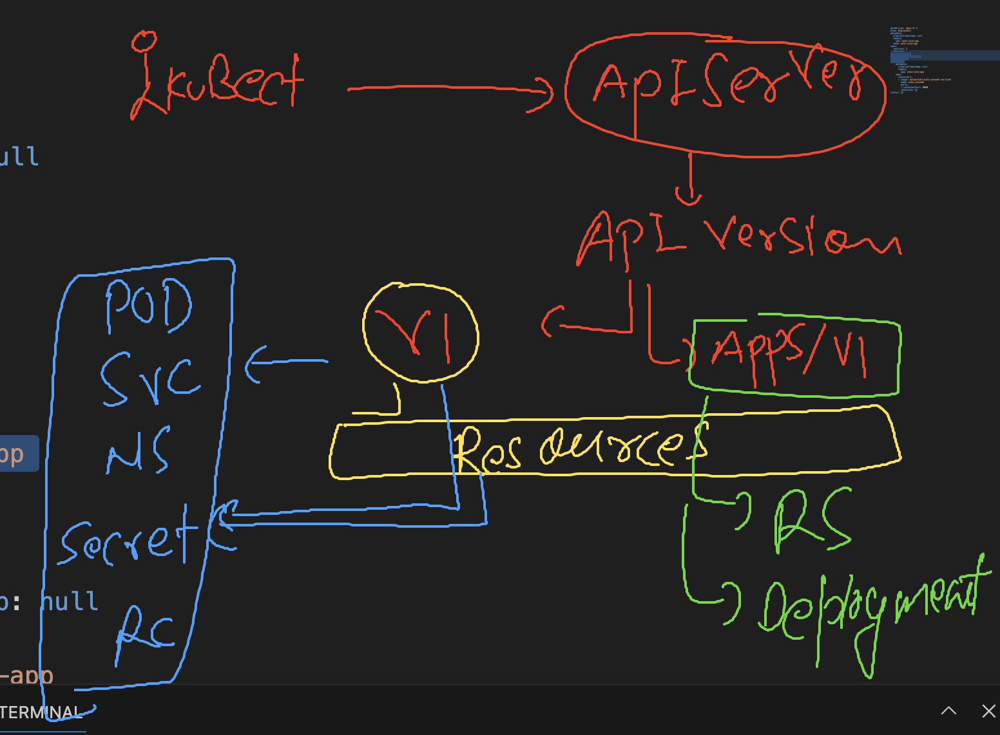

# k8s-cloud4c-b4

### connecting to the lab env

```
[ashu@ip-172-31-9-111 ashu-apps]$ kubectl config get-contexts 
CURRENT   NAME                          CLUSTER      AUTHINFO           NAMESPACE
*         kubernetes-admin@kubernetes   kubernetes   kubernetes-admin   ashu-space
[ashu@ip-172-31-9-111 ashu-apps]$ kubectl  get all
NAME           READY   STATUS    RESTARTS      AGE
pod/ashupod1   1/1     Running   2 (12m ago)   22h
[ashu@ip-172-31-9-111 ashu-apps]$ kubectl  delete all --all
pod "ashupod1" deleted

```

### introduction to controllers in k8s


### Introduction to Replication controller


### introduction to deployment controller in k8s


### more info about deployment controller


### creating deployment controller manifest file 

```
kubectl   create  deployment  ashu-java-app --image=dockerashu/ashu-javaweb:version5 --port 8080 --dry-run=client -o yaml  >deployment1.yaml 
```

### apiversion and resources



### YAML of Deployment 

```
apiVersion: apps/v1 # 
kind: Deployment
metadata:
  creationTimestamp: null
  labels:
    app: ashu-java-app
  name: ashu-java-app # name of deployment 
spec:
  replicas: 1 # number of pod we want 
  selector:
    matchLabels:
      app: ashu-java-app
  strategy: {}
  template: # using template deployment create pods 
    metadata:
      creationTimestamp: null
      labels: # pods label 
        app: ashu-java-app
    spec:
      containers:
      - image: dockerashu/ashu-javaweb:version5
        name: ashu-javaweb
        ports:
        - containerPort: 8080
        resources: {}
status: {}

```

### lets send create request to the pod

```
[ashu@ip-172-31-9-111 ashu-k8s-manifest]$ kubectl   create  -f  deployment1.yaml 
deployment.apps/ashu-java-app created
[ashu@ip-172-31-9-111 ashu-k8s-manifest]$ kubectl   get deployment 
NAME            READY   UP-TO-DATE   AVAILABLE   AGE
ashu-java-app   0/1     1            0           6s
[ashu@ip-172-31-9-111 ashu-k8s-manifest]$ 
[ashu@ip-172-31-9-111 ashu-k8s-manifest]$ kubectl   get  deploy 
NAME            READY   UP-TO-DATE   AVAILABLE   AGE
ashu-java-app   0/1     1            0           11s
[ashu@ip-172-31-9-111 ashu-k8s-manifest]$ kubectl   get  pods
NAME                             READY   STATUS              RESTARTS   AGE
ashu-java-app-6d9698856c-574d6   0/1     ContainerCreating   0          16s
[ashu@ip-172-31-9-111 ashu-k8s-manifest]$ kubectl   get  pods -o wide
NAME                             READY   STATUS              RESTARTS   AGE   IP       NODE    NOMINATED NODE   READINESS GATES
ashu-java-app-6d9698856c-574d6   0/1     ContainerCreating   0          19s   <none>   node3   <none>           <none>
[ashu@ip-172-31-9-111 ashu-k8s-manifest]$ 

```

