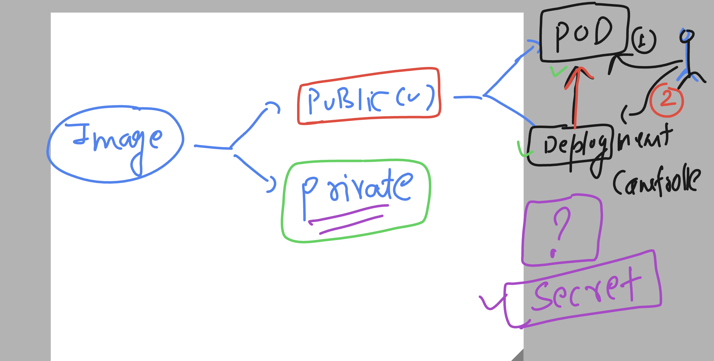

# k8s-cloud4c-b4

### testing lab and delete all the resource of current namespace

```
[ashu@ip-172-31-9-111 ashu-apps]$ kubectl config get-contexts 
CURRENT   NAME                          CLUSTER      AUTHINFO           NAMESPACE
*         kubernetes-admin@kubernetes   kubernetes   kubernetes-admin   ashu-space

[ashu@ip-172-31-9-111 ashu-apps]$ kubectl  get  all
NAME                             READY   STATUS    RESTARTS        AGE
pod/ashu-appp-7b99cb4549-9fm5j   1/1     Running   2 (8m17s ago)   22h
pod/ashu-appp-7b99cb4549-hd5ml   1/1     Running   2 (8m20s ago)   22h
pod/ashu-appp-7b99cb4549-qf2p4   1/1     Running   2 (8m18s ago)   22h
pod/ashu-appp-7b99cb4549-xfgxs   1/1     Running   2 (8m17s ago)   22h

NAME             TYPE       CLUSTER-IP     EXTERNAL-IP   PORT(S)          AGE
service/ashulb   NodePort   10.99.33.207   <none>        3000:31831/TCP   22h

NAME                        READY   UP-TO-DATE   AVAILABLE   AGE
deployment.apps/ashu-appp   4/4     4            4           22h

NAME                                   DESIRED   CURRENT   READY   AGE
replicaset.apps/ashu-appp-7b99cb4549   4         4         4       22h


[ashu@ip-172-31-9-111 ashu-apps]$ kubectl delete all --all
pod "ashu-appp-7b99cb4549-9fm5j" deleted
pod "ashu-appp-7b99cb4549-hd5ml" deleted
```

### understanding image deployment in public and private sense 



### creating deployment manifest file 

```
[ashu@ip-172-31-9-111 ashu-k8s-manifest]$ kubectl create -f day9_deployment.yaml 
deployment.apps/ashu-react-app created
[ashu@ip-172-31-9-111 ashu-k8s-manifest]$ kubectl   get  deploy
NAME             READY   UP-TO-DATE   AVAILABLE   AGE
ashu-react-app   1/1     1            1           4s
[ashu@ip-172-31-9-111 ashu-k8s-manifest]$ kubectl   get  pods
NAME                             READY   STATUS    RESTARTS   AGE
ashu-react-app-cff887d7f-6jkxn   1/1     Running   0          19s
[ashu@ip-172-31-9-111 ashu-k8s-manifest]$ 
```

## pod scaling manually 


### manual pod scaling without manifest file 

```
[ashu@ip-172-31-9-111 ashu-k8s-manifest]$ kubectl   get  deploy 
NAME             READY   UP-TO-DATE   AVAILABLE   AGE
ashu-react-app   1/1     1            1           7m3s
[ashu@ip-172-31-9-111 ashu-k8s-manifest]$ 
[ashu@ip-172-31-9-111 ashu-k8s-manifest]$ kubectl  scale  deployment  ashu-react-app  --replicas 4 
deployment.apps/ashu-react-app scaled
[ashu@ip-172-31-9-111 ashu-k8s-manifest]$ kubectl   get  deploy 
NAME             READY   UP-TO-DATE   AVAILABLE   AGE
ashu-react-app   4/4     4            4           7m27s
[ashu@ip-172-31-9-111 ashu-k8s-manifest]$ kubectl   get po 
NAME                             READY   STATUS    RESTARTS   AGE
ashu-react-app-cff887d7f-52gp4   1/1     Running   0          12s
ashu-react-app-cff887d7f-6jkxn   1/1     Running   0          7m33s
ashu-react-app-cff887d7f-hc2x9   1/1     Running   0          12s
ashu-react-app-cff887d7f-lt5cn   1/1     Running   0          12s
[ashu@ip-172-31-9-111 ashu-k8s-manifest]$ 
```


